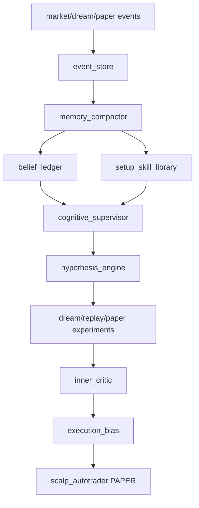

# Self Thinking Trading Agent Development

## Overview

Build practical self-thinking, not fake consciousness. The agent should observe market state, retrieve memory, form falsifiable hypotheses, run paper/replay/dream experiments, critique decisions, update beliefs, and only then affect PAPER execution through conservative gates.

Target: make the system live-ready within 14 calendar days if, and only if, validated PAPER metrics pass. The target win-rate is 80 percent, but win-rate alone is not enough because tiny TP / huge SL can fake a high win-rate. Live promotion also requires positive expectancy, positive net PnL after fees/slippage, bounded drawdown, fresh data, and enough closed trades.

Existing reusable code: `event_store.py`, `market_learner.py`, `reflection_agent.py`, `dream_cycle.py`, `scalp_autotrader.py`, tests under `tests/`. No `docs/` directory exists in this repo, so plan follows current code patterns.

## Cross-Plan Dependencies

| Relationship | Plan | Status |
| --- | --- | --- |
| Reference | [Self Thinking Research](../reports/260620-1502-self-thinking-agent-roadmap.md) | complete |
| Reference | [Market Intelligence Roadmap](../reports/260620-1400-market-intelligence-roadmap.md) | complete |
| Reference | [News Macro Observer](../260621-0136-news-macro-observer/plan.md) | planned |

## Scope Challenge

- Existing code: memory/reflection/dream/event store already exist; reuse them.
- Minimum change: belief ledger, setup skill library, hypothesis engine, supervisor, critic hook.
- Deferred: RL, full web dashboard, high-frequency order book.
- Included: live-readiness path with shadow-live and micro-live gates.
- Complexity: 8 phases because each component needs isolated tests and rollback path.

## Phases

| Phase | Name | Status |
| --- | --- | --- |
| 1 | [Belief Ledger](./phase-01-belief-ledger.md) | Complete |
| 2 | [Setup Skill Library](./phase-02-setup-skill-library.md) | Complete |
| 3 | [Hypothesis Engine](./phase-03-hypothesis-engine.md) | Complete |
| 4 | [Cognitive Supervisor](./phase-04-cognitive-supervisor.md) | Complete |
| 5 | [Inner Critic Gate](./phase-05-inner-critic-gate.md) | Complete |
| 6 | [Curiosity And Memory Compaction](./phase-06-curiosity-memory-compaction.md) | Complete |
| 7 | [Validation And Status Surface](./phase-07-validation-status-surface.md) | Partial |
| 8 | [Fourteen Day Live Readiness Ramp](./phase-08-fourteen-day-live-readiness-ramp.md) | Pending |
| 9 | [Shadow Trade Learning](./phase-09-shadow-trade-learning.md) | Complete |

## Architecture

## Non-Negotiables

- Thinking layer cannot place live trades.
- LLM output must be advisory and schema-validated.
- Deterministic risk gates own final allow/block decisions.
- Every paper trade must be explainable by setup id, hypothesis id, critic verdict.
- No live mode expansion until paper validation passes.
- No promise of profit or 80 percent win-rate. The system can enforce learning, validation, and promotion gates; the market decides outcomes.

## Fourteen Day Target Gate

Promotion from PAPER to live is allowed only if all conditions pass:

| Metric | Required |
| --- | --- |
| Closed PAPER trades | >= 80 total, >= 20 in the leading setup |
| PAPER win-rate | >= 80 percent over latest validated window |
| Net PnL | > 0 after fees and slippage assumptions |
| Expectancy | > 0 per trade |
| Profit factor | >= 1.5 |
| Max drawdown | <= 10 percent of paper equity window |
| Consecutive loss cap | <= 2 before sleep/block activates |
| Data health | observer, dream, supervisor, critic heartbeats fresh |
| Segment quality | no active setup with hidden negative expectancy |
| Live mode | micro-live only first; no high leverage ramp on day one |

If any condition fails on day 14, the agent remains PAPER and produces a failure report explaining what must improve. This is required behavior, not optional.

## Daily Learning Cadence

| Timeframe | Required cycle |
| --- | --- |
| Every 1-5 minutes | Market/data observation and PAPER opportunity scan |
| Every 15-30 minutes | Cognitive supervisor: focus, hypothesis, critic review |
| Every 30 minutes | Dream simulation and risk tightening |
| Every 24 hours | Memory compaction, belief update, setup stats, target report |
| Day 7 | Midpoint review: drop weak setups, focus on top evidence setup |
| Day 14 | Live-readiness decision: paper-only, shadow-live, or micro-live |

## Live Promotion Ladder

1. PAPER: no real orders. Collect setup/hypothesis/critic evidence.
2. Shadow-live: follow live market and generate would-trade records without orders.
3. Micro-live: smallest allowed real size, leverage capped, hard kill-switch.
4. Scale review: only after micro-live survives a separate validation window.

Hard stops during micro-live:

- Any stale heartbeat.
- Two consecutive live losses.
- Daily net loss below configured cap.
- Slippage above modeled threshold.
- Any order without setup id, hypothesis id, and critic verdict.

## Dependencies

- Existing Python stdlib-first style.
- SQLite through `event_store.py`.
- Optional 9Router/GPT only for supervisor/reflection text, never direct execution.
- Existing test command: `venv\Scripts\python.exe -m pytest tests -q`.

## Risk References

- CFTC warns virtual currency spot/futures/options speculation has substantial risk: https://www.cftc.gov/LearnAndProtect/AdvisoriesAndArticles/understand_risks_of_virtual_currency.html
- SEC investor alert says crypto assets can be exceptionally volatile and speculative: https://www.investor.gov/introduction-investing/general-resources/news-alerts/alerts-bulletins/investor-alerts/crypto-asset-securities
- RiskLab cross-validation reference for avoiding leakage in financial ML: https://www.risklab.ai/research/financial-modeling/cross_validation

## Definition Of Done

- Agent has persistent beliefs with confidence and evidence.
- Setup skills are named, versioned, measurable.
- Supervisor runs on schedule and writes heartbeat/status.
- Inner critic can block weak PAPER entries with explicit reasons.
- Tests cover normal, missing-data, malformed-data, and stale-data paths.
- PAPER mode remains default and live gate remains strict.
- 14-day report can prove whether the system passed or failed live-readiness.
