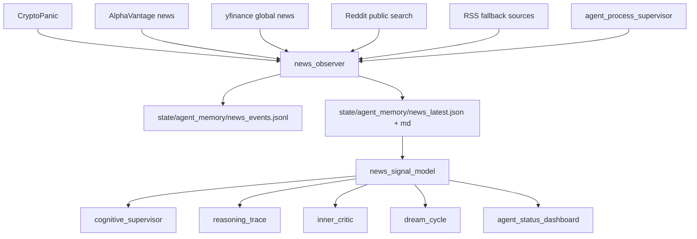

# News Macro Observer

## Overview

Build a runtime observer that continuously reads crypto, macro, regulatory, political-financial, and social/news inputs, normalizes them into auditable events, scores risk/catalysts, and feeds the self-thinking agent.

This is a sensor and risk-context layer. It cannot place orders, cannot loosen leverage, and cannot override deterministic gates. It can only add context, create hypotheses, tighten paper-entry requirements, block unsafe PAPER/live readiness, and annotate shadow/paper trades.

Existing reusable code: `tradingagents_crypto_src/tradingagents/dataflows/cryptopanic.py`, `alpha_vantage_news.py`, `yfinance_news.py`, `reddit.py`, `news_analyst.py`, `multi_agent_research.py`, `event_store.py`, `inner_critic.py`, `cognitive_supervisor.py`, `reasoning_trace.py`, `agent_status_dashboard.py`, and `agent_process_supervisor.py`.

## Cross-Plan Dependencies

| Relationship | Plan | Status |
| --- | --- | --- |
| Reference | [Self Thinking Trading Agent Development](../260620-1506-self-thinking-agent-development/plan.md) | in-progress |

## Scope Challenge

- Minimum useful version: one long-running `news_observer.py`, one deterministic `news_signal_model.py`, JSON/MD latest files, heartbeat, tests, dashboard visibility.
- Do not build a broad web crawler first. Reuse available sources and add a small RSS/fallback adapter only where needed.
- Do not let LLM summaries drive entries. LLM can summarize and classify, but deterministic rules own risk outputs.
- Do not integrate X scraping until credentials/API/path is explicit. Model the interface now; implement trusted sources first.
- This improves market understanding, not guaranteed profitability. Promotion remains bound by PAPER metrics from the self-thinking plan.

## Phases

| Phase | Name | Status |
| --- | --- | --- |
| 1 | [News Source Ingestion](./phase-01-news-source-ingestion.md) | Complete |
| 2 | [News Signal Model](./phase-02-news-signal-model.md) | Complete |
| 3 | [Risk And Cognition Integration](./phase-03-risk-cognition-integration.md) | Partial |
| 4 | [Dashboard And Process Supervision](./phase-04-dashboard-process-supervision.md) | Complete |
| 5 | [Validation And Rollout](./phase-05-validation-rollout.md) | Partial |

## Architecture

## Runtime Outputs

| Path | Purpose |
| --- | --- |
| `state/agent_memory/news_events.jsonl` | Append-only normalized headline/event history |
| `state/agent_memory/news_latest.json` | Latest scored news/macro state |
| `state/agent_memory/news_latest.md` | Human-readable latest report |
| `state/news_observer_heartbeat.json` | Process freshness and source health |
| `event_store` source `news_observer` | Auditable events and heartbeat rows |

## Risk Contract

The news layer is tighten-only:

- High macro/regulatory risk can block or tighten PAPER entries.
- Relevant symbol catalyst chaos can block a symbol temporarily.
- Fresh strong catalyst can add hypothesis context, but cannot reduce score thresholds, increase leverage, or bypass setup matching.
- Stale or missing news should be visible; it should not silently be treated as bullish.
- Every paper/shadow trade should record the news regime snapshot used at decision time.

## Success Criteria

- `news_observer.py --once` writes latest JSON, latest MD, events JSONL, and heartbeat without printing secrets.
- Deterministic fixture headlines produce stable scores for macro risk, regulatory risk, catalyst impact, source quality, and symbol impacts.
- `inner_critic.py` blocks/tightens on high-risk news and never loosens controls due to news.
- `cognitive_supervisor.py` and `reasoning_trace.py` include news context, contradictions, and missing evidence.
- Dashboard shows news freshness, source health, top headlines, and current risk scores in one UI.
- Supervisor starts/restarts `news_observer.py` like the other helper agents.
- Full test suite passes with `PYTEST_DISABLE_PLUGIN_AUTOLOAD=1`.

## Non-Negotiables

- No live orders from the news observer.
- No API key values in logs, reports, dashboard, or test fixtures.
- News/social data is noisy; source scoring, dedupe, freshness decay, and malformed payload handling are required.
- PAPER remains default. Live readiness still requires the 14-day metrics from the self-thinking plan.

## Implementation Order

1. Build ingestion and persistence first.
2. Add deterministic scoring and fixture tests.
3. Wire risk/cognition integrations as tighten-only.
4. Add dashboard and process supervision.
5. Run smoke, then full tests.

## Implementation Notes

- Added `news_observer.py` and `news_signal_model.py`.
- Added tests: `tests/test_news_observer.py`, `tests/test_news_signal_model.py`, plus dashboard/supervisor/critic coverage.
- Added `news_observer` to `agent_process_supervisor.py`.
- Added News tab and news log access to `agent_status_dashboard.py`.
- Added tighten-only news context to `inner_critic.py`.
- Runtime smoke passed: `news_observer.py --once` wrote latest JSON/MD/events/heartbeat.
- Full tests passed: `131 passed, 3 warnings`.
