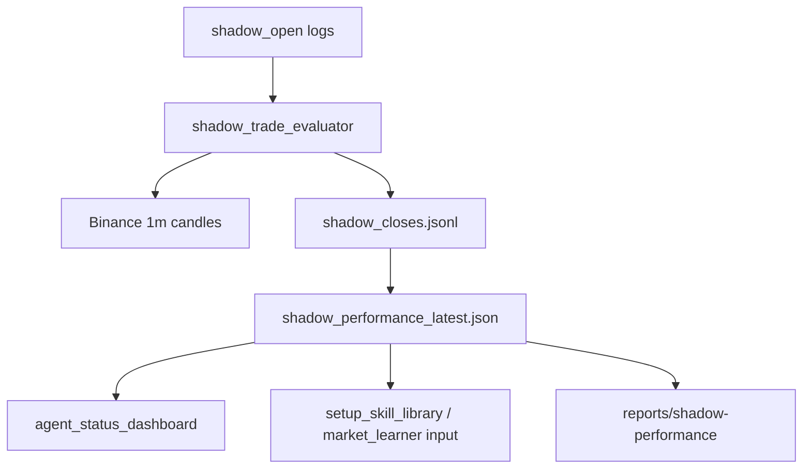

# Shadow Performance Loop

## Overview

Build the missing feedback loop between `shadow_open` observations and measurable setup performance. Current local evidence shows 785 shadow samples and 0 closed shadow outcomes. Without closed outcomes the agent cannot know whether blocked entries would have won, lost, or been too expensive after fees/slippage.

This plan intentionally does not place live orders. It only scores simulated would-trades and exposes the result to the dashboard and learning layer.

## Scope Challenge

| Question | Answer |
| --- | --- |
| What already exists? | `shadow_trade_logger.py` records shadow opens and has a mark-based evaluator helper. `scalp_autotrader.py` emits `shadow_open`. `agent_status_dashboard.py` already summarizes paper stats. `market_learner.py`, `setup_skill_library.py`, and `cognitive_supervisor.py` can consume performance stats once produced. |
| Minimum change set | Add shadow close evaluator, aggregate metrics, dashboard display, and tests. Defer full replay/walk-forward engine and news-alpha scoring. |
| Complexity check | 4 phases, about 4-6 files touched plus tests. One new script/module is justified because closing/evaluating shadow trades is a separate offline process. |

Selected mode: HOLD SCOPE. Build the core metric loop cleanly before expanding.

## Cross-Plan Dependencies

| Relationship | Plan | Status | Notes |
| --- | --- | --- | --- |
| Reference | [Self Thinking Trading Agent Development](../260620-1506-self-thinking-agent-development/plan.md) | in-progress | Phase 09 already created shadow logging; this plan extends it with outcome scoring. |
| Reference | [Performance Money Roadmap](../reports/260621-1029-performance-money-roadmap.md) | complete | Research decision: shadow evaluator is highest ROI next step. |

No blocking dependency is set because the required shadow logging output already exists and is populated.

## Phases

| Phase | Name | Status |
| --- | --- | --- |
| 1 | [Shadow Close Evaluator](./phase-01-shadow-close-evaluator.md) | Complete |
| 2 | [Performance Aggregation](./phase-02-performance-aggregation.md) | Complete |
| 3 | [Dashboard And Learning Integration](./phase-03-dashboard-learning-integration.md) | Complete |
| 4 | [Validation And Rollout](./phase-04-validation-rollout.md) | Complete |

## Completion Notes

- Implemented `shadow_trade_evaluator.py` with deterministic schema, assumptions hash, close IDs, candle evaluation, idempotent append, aggregation, markdown report, and dashboard-ready latest JSON.
- Dashboard now exposes shadow performance separately from paper/live metrics and labels it as would-trade only.
- Verification: `venv\Scripts\python.exe -m pytest tests -q` -> `160 passed, 3 warnings`.
- Rollout produced `state/agent_memory/shadow_closes.jsonl`, `state/agent_memory/shadow_performance_latest.json`, and `plans/reports/260621-044507-shadow-performance.md`.
- Data-quality note: full 72h run evaluated 785 shadow opens, closed/scored 280, and marked 505 as `api_error` after Binance returned HTTP 418 rate-limit. The evaluator now stops further fetches on 418/429 and records error detail for future runs.
- Current shadow result is not promotable: 280 closed, win-rate 11.43%, net -0.83061825, expectancy -0.00296649, profit factor 0.068, promotion candidates 0.

## Architecture



## Red-Team Additions

This plan was reviewed for missing failure modes before implementation. Required additions:

| Area | Requirement |
| --- | --- |
| Idempotency | Every close record must include `schema_version`, `run_id`, `assumption_hash`, and deterministic `close_id`. Reruns with same assumptions must not duplicate closes. |
| Assumptions | Fee, slippage, candle interval, ambiguity policy, max hold, and data source must be persisted in every output. |
| Unresolved trades | Metrics must report unresolved/timeout counts; do not silently ignore non-closed trades because that biases results toward fast winners/losses. |
| Data quality | Outputs must include skipped/malformed/API-error counts, candle coverage, incomplete candle count, and ambiguity count. |
| Binance pagination | Kline fetching must handle request limits and multi-page ranges. |
| Candle limitation | 1m candles cannot prove intraminute order when TP and SL both hit; such rows must be conservative and labeled. |
| Raw data cache | Optional local candle cache should be supported to reduce rate-limit pressure and make reruns reproducible. |
| Atomic writes | Latest JSON snapshots must be written atomically via temp file + replace. JSONL append must be duplicate-safe by `close_id`. |
| Learning safety | Shadow stats can only tighten/block initially. They cannot promote live or loosen risk by themselves. |

## Non-Goals

- No live trade placement.
- No automatic promotion to live.
- No full historical strategy optimizer in this pass.
- No LLM-based trade decision expansion.
- No change to user-owned `unified_monitor.py` unless explicitly requested later.

## Success Criteria

| Metric | Requirement |
| --- | --- |
| Shadow closes | Can close/evaluate existing shadow samples when Binance candles are available. |
| Fee/slippage | Net PnL includes two-sided fee and configurable slippage. |
| Ambiguity | Same-candle TP+SL is handled conservatively and labeled. |
| Aggregates | Produces WR, net, expectancy, profit factor, avg win/loss, max drawdown, time-to-exit, by symbol/side/score/setup/regime where available. |
| Dashboard | Shows shadow performance separately from paper performance. |
| Tests | Deterministic tests cover long TP, long SL, short TP, short SL, ambiguous candle, malformed input, aggregation math. |
| Safety | Evaluator is read-only toward exchange and cannot place orders. |

## Implementation Guardrails

- Use stdlib-first style consistent with current repo.
- Use `apply_patch` for edits.
- Keep live keys/order functions out of evaluator.
- Cache or throttle Binance market-data calls to avoid rate-limit waste.
- Make network fetch optional/injectable so tests are offline and deterministic.
- Treat incomplete candles carefully; do not score a trade on future data that is not available.
- Produce deterministic outputs: same inputs + same assumptions => same close IDs and metrics.
- Keep `paper`, `shadow`, and `live` metrics physically and visually separate.
- Prefer conservative scoring when data cannot prove event order.
- Do not update setup skill stats directly from shadow closes in this plan; expose shadow evidence separately first.

## Cook Handoff

When approved, implement with:

```powershell
/ck:cook plans/260621-1112-shadow-performance-loop/plan.md --auto
```

If doing manually in this session, start at phase 01 and run tests after each phase boundary.
