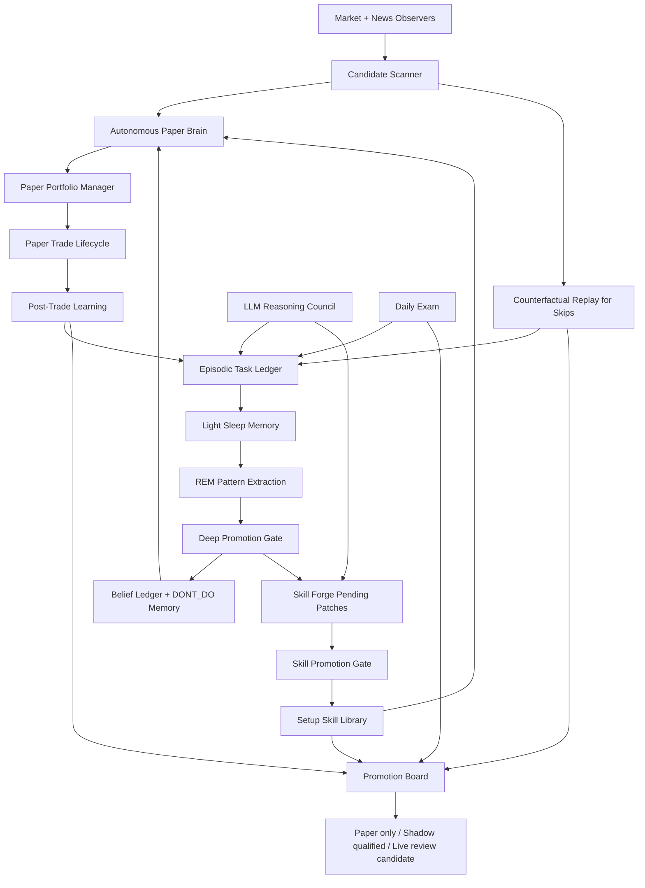

# Autonomous Paper Learning Agent Masterplan

## Goal

Build a 24/7 autonomous paper-trading learner that uses a simulated 100 USDT account, learns objectively after every trade/signal, remembers durable lessons, evolves setup skills, and proves readiness before any real-money autonomy.

This is not a live-trading plan. Live autonomy remains blocked until paper/shadow promotion gates pass with clean data.

## Source Architectures To Fuse

| Source | What to borrow | Trading-specific constraint |
| --- | --- | --- |
| Current trading agent | Market/news observers, paper/shadow logs, risk gate, setup skills, dashboard, supervisor | Execution stays deterministic; dashboard read-only |
| OpenClaw | Light/REM/Deep memory consolidation and promotion gates | Memories become rules only after evidence, not after one trade |
| Hermes | Episodic task memory, autonomous skill creation/update after tasks, scheduled background review | Skill patches are staged and gated; no direct live execution |
| 9router/gpt-5.5 | Large-model critique, blindspot discovery, curriculum, post-trade explanation | LLM proposes only; sanitizer forbids live orders/risk loosening |

## Existing Plans And Dependencies

| Existing plan | Status | Relationship |
| --- | --- | --- |
| `260620-1506-self-thinking-agent-development` | in-progress | This masterplan extends it and should eventually become its next major phase. |
| `260621-0136-news-macro-observer` | in-progress | News/macro context is a required input to post-trade learning and regime modeling. Phase A can start without it; Phase B+ must degrade cleanly until this input is reliable. |
| `260621-1112-shadow-performance-loop` | completed | Shadow close metrics are a required input to skill forge and promotion gates. |

## Non-Negotiables

- Paper/shadow only until promotion gates pass.
- LLM output is advisory and sanitized.
- Deterministic risk gate owns final allow/block decisions.
- Every trade/signal must be explainable by setup id, risk decision, memory recall, and market context.
- No setup or memory can promote from one anecdote.
- No live autonomy from win-rate alone.
- The system must be allowed to trade paper, experiment, and learn; it must not be over-blocked into doing nothing.

## Master Architecture



---

# Plan 1: Paper Capital Manager

## Objective

Make the 100 USDT paper account behave like a real futures portfolio, including sizing, leverage, exposure, fees, slippage, daily drawdown, and adaptive risk.

## Modules

- `paper_portfolio_manager.py`
- `state/paper_account.json`
- `state/agent_memory/paper_risk_state.json`
- dashboard paper capital panel

## Decisions It Owns

- paper margin per trade
- paper leverage per trade
- max open paper positions
- daily paper loss limit
- cooldown after losses
- size reduction during high volatility/news chaos
- size increase only in paper after stable evidence

## Inputs

- `shadow_performance_latest.json`
- `setup_skills.json`
- `execution_bias.json`
- `news_latest.json`
- market volatility/range/funding snapshot
- recent paper drawdown

## Outputs

```json
{
  "paper_equity": 100.0,
  "risk_per_trade_pct": 0.5,
  "selected_margin": 1.0,
  "selected_leverage": 10,
  "max_loss_if_sl": 0.5,
  "reason": "volatility high, setup under-sampled",
  "can_open_paper": true
}
```

## Tests

- Equity decreases after loss and increases after win.
- Leverage decreases when volatility/news chaos is high.
- Daily drawdown blocks new paper entries.
- No negative equity or impossible margin.
- Size cannot increase after under-sampled or negative-expectancy setup.

## Done

- Every paper open includes margin/leverage/risk decision id.
- Dashboard shows paper equity, drawdown, risk per trade, open exposure.

---

# Plan 2: Autonomous Paper Trading Brain

## Objective

Allow the agent to trade the simulated 100 USDT account 24/7 without real orders.

## Modules

- `paper_trading_brain.py`
- `paper_signal_selector.py`
- integration with `scalp_autotrader.py` paper path or a cleaner paper-only executor

## Loop

```text
market/news update
-> candidate scan
-> setup match
-> memory/DONT_DO recall
-> LLM critique optional
-> deterministic risk gate
-> portfolio sizing
-> paper open/skip
-> paper monitor close
-> post-trade learning
```

## Trade Policy

- It should be allowed to open paper trades when evidence is sufficient.
- It should record why it skipped.
- It should not require perfect certainty; paper is for learning.
- It should not trade if lifecycle/data quality is broken.

## Outputs

- `paper_open`
- `paper_close`
- `paper_skip`
- `paper_risk_decision`
- `paper_brain_heartbeat.json`

## Tests

- Opens paper trade on valid candidate with clean data.
- Skips when DONT_DO matches.
- Skips when portfolio manager blocks risk.
- Writes deterministic decision record for every candidate.

## Done

- Agent can run overnight and produce paper decisions without user intervention.

---

# Plan 3: Trade Lifecycle Integrity

## Objective

Prevent dirty paper/shadow data from poisoning learning.

## Required Schema

Every trade-like event must have:

```text
trade_id, mode, symbol, side, setup_id, hypothesis_id,
open_ts, close_ts, entry, exit, qty, margin, leverage,
sl, tp, fee, slippage, signal_score, risk_decision_id,
market_snapshot_id, news_snapshot_id, reasoning_id, status
```

## Modules

- `trade_lifecycle_validator.py`
- `state/agent_memory/trade_lifecycle_latest.json`
- dashboard lifecycle health row

## Checks

- open without close too long
- close without open
- duplicate trade id
- impossible qty/leverage
- missing setup id
- missing risk decision
- stale market/news snapshot

## Tests

- Detect orphan close.
- Detect duplicate open.
- Detect missing setup id.
- Detect stale snapshot.
- Do not let invalid lifecycle feed skill forge.

## Done

- `trade_lifecycle_completeness >= 99%` before any promotion review.

---

# Plan 4: Post-Trade Learning Agent

## Objective

Learn objectively from every closed paper/shadow/live-review trade. Do not learn only from PnL.

## Modules

- `post_trade_learning_agent.py`
- `state/agent_memory/post_trade_reviews.jsonl`
- `state/agent_memory/post_trade_learning_latest.json`

## Classification

```text
good_win
bad_win
good_loss
bad_loss
stop_too_tight
tp_too_far
late_entry
early_entry
regime_shift
news_conflict
spread_slippage_issue
setup_invalid
risk_gate_saved_trade
risk_gate_missed_winner
```

## Learning Inputs

- paper/shadow close
- market candles around entry/exit
- market/news snapshots
- setup skill definition
- risk decision
- LLM reasoning id

## Metrics

- MAE/MFE
- R multiple
- time to MFE
- time to stop/TP
- fees/slippage impact
- process quality score
- outcome quality score

## Tests

- Winning trade with bad process is `bad_win`.
- Losing trade with valid setup and positive MFE is not automatically setup failure.
- Stop too tight is detected when post-stop price reaches planned TP.
- News conflict is detected when high-risk headline existed before entry.

## Done

- Every closed paper/shadow trade gets a review row before skill updates.

---

# Plan 5: Counterfactual Replay Agent

## Objective

Learn from skipped/blocked signals and alternative SL/TP/entry choices so the agent does not become blindly conservative.

## Modules

- `counterfactual_replay_agent.py`
- `state/agent_memory/counterfactual_replays.jsonl`
- `state/agent_memory/counterfactual_latest.json`

## Replays

For each signal/trade:

```text
entry actual
entry +1 candle
entry -1 candle
SL 0.5x / 1x / 1.5x
TP 0.5R / 1R / 1.5R / trailing
skip trade
smaller leverage
larger leverage only in paper
```

## Outputs

- risk gate false positives
- risk gate true positives
- stop/TP parameter suggestions
- timing suggestions
- setup-specific counterfactual expectancy

## Tests

- Blocked winner is recorded but does not instantly loosen gate.
- Blocked loser strengthens DONT_DO/risk gate evidence.
- Counterfactual requires enough candle coverage.

## Done

- Daily exam can ask whether gates are too strict based on counterfactual sample size.

---

# Plan 6: Episodic Task Ledger

## Objective

Give the agent Hermes-style memory of what it did, why, and what happened.

## Modules

- `episodic_task_ledger.py`
- SQLite table or JSONL mirror: `state/agent_memory/episodes.jsonl`
- `episodes_latest.json`

## Episode Schema

```json
{
  "episode_id": "...",
  "trigger": "paper_close|daily_exam|llm_reasoning|market_event|skill_patch",
  "goal": "...",
  "context_refs": [],
  "decision": {},
  "actions": [],
  "outcome": {},
  "lesson": "...",
  "next_action": "...",
  "quality": 0.0
}
```

## Tests

- Idempotent episode append by event id.
- Episode links to trade/reasoning/exam ids.
- Failed task is still recorded with error.

## Done

- Every major agent writes episodes, not just logs.

---

# Plan 7: OpenClaw-Style Memory Consolidation

## Objective

Convert raw episodes into durable memory with Light/REM/Deep phases.

## Modules

- `memory_consolidation_agent.py`
- `memory_candidates.jsonl`
- `memory_promoted.jsonl`
- `memory_rejected.jsonl`

## Phases

| Phase | Job | Output |
| --- | --- | --- |
| Light Sleep | dedupe and stage recent episodes | candidates |
| REM | extract repeated patterns/failure themes | pattern clusters |
| Deep Sleep | score and promote/reject | durable memories |

## Promotion Gate

```text
min_recall_count >= 2
min_unique_contexts >= 2
min_trade_samples >= configured threshold for trade rules
not_contradicted_by_shadow
confidence_score >= 0.65
not_duplicate_existing_memory
```

## Tests

- One anecdote cannot promote.
- Contradicted lesson is rejected or staged.
- Repeated lesson across multiple contexts can promote.

## Done

- `belief_ledger` consumes promoted memories, not raw lessons.

---

# Plan 8: DONT_DO Memory

## Objective

Stop repeated mistakes without making the whole system over-conservative.

## Modules

- `dont_do_memory.py`
- `state/agent_memory/dont_do_memory.json`
- `inner_critic.py` lookup integration

## Entry Schema

```json
{
  "rule_id": "...",
  "condition": "do not long alt momentum when BTC/ETH breadth is red",
  "scope": "setup|symbol|regime|global",
  "evidence_count": 0,
  "counter_evidence_count": 0,
  "expires_at": null,
  "severity": "high"
}
```

## Tests

- Matching DONT_DO blocks paper or forces shadow-only.
- Counter-evidence can weaken but not instantly delete rule.
- Expired rule no longer blocks.

## Done

- Every paper candidate passes DONT_DO lookup before open.

---

# Plan 9: Hermes-Style Skill Forge

## Objective

Let the agent propose and improve setup skills after tasks/trades, but only promote via deterministic gates.

## Modules

- `skill_forge_agent.py`
- `skill_patches_pending.jsonl`
- `skill_patch_reviews.jsonl`
- `setup_skill_library.py` promotion integration

## Flow

```text
post-trade reviews + memories + shadow stats
-> LLM proposes skill patch
-> schema validation
-> deterministic evidence gate
-> pending / rejected / paper-only promoted
```

## Patch Types

- new setup skill
- invalidation rule
- SL/TP template update
- regime filter
- sample target
- disable/retire weak skill

## Tests

- LLM patch missing invalidation is rejected.
- Skill with negative expectancy cannot promote.
- New skill starts as `paper_shadow_only`.

## Done

- Setup skills evolve from evidence, not manual edits only.

---

# Plan 10: Retrieval Memory Search

## Objective

Give the agent recall beyond latest JSON files.

## Modules

- `memory_retrieval.py`
- SQLite FTS5 tables for episodes, lessons, exams, post-trade reviews, LLM critiques, DONT_DO, skills

## Queries Needed

```text
What happened last time exhaustion_fade traded a 25% pump?
Which risk gates blocked winners?
Which setup has positive expectancy in risk_on but negative in risk_off?
What did GPT-5.5 warn about this week?
Which mistakes repeat after cooldown?
```

## Tests

- FTS returns relevant memory for setup/symbol/regime.
- Search excludes stale/retired memories by default.
- Retrieval handles empty DB.

## Done

- `paper_trading_brain`, `inner_critic`, and `llm_reasoning_agent` can retrieve relevant memory by context.

---

# Plan 11: LLM Council

## Objective

Upgrade single `llm_reasoning_agent` into specialist roles while keeping sanitized output.

## Agents

- Market Analyst
- Risk Critic
- Setup Engineer
- Post-Trade Reviewer
- Memory Curator
- Skill Forge Reviewer

## Constraints

- all use 9router `cx/gpt-5.5` or configured model
- no order placement
- no direct file mutation except their own latest/history outputs
- final synthesis must pass sanitizer

## Tests

- Unsafe role output is sanitized.
- Missing provider degrades gracefully.
- Council output references data ids, not vague claims only.

## Done

- Daily exam and skill forge consume council synthesis.

---

# Plan 12: Promotion Board And Readiness Gate

## Objective

Define exactly when paper-only becomes shadow-qualified, then live-review-candidate.

## States

```text
raw lesson -> candidate memory -> tested belief -> active rule -> retired rule
raw setup idea -> candidate skill -> paper-only skill -> shadow-qualified -> live-review-candidate
paper account -> qualified paper account -> micro-live review candidate
```

## Minimum Live-Review Gate

| Metric | Requirement |
| --- | --- |
| Paper trades | >= 300, lifecycle completeness >= 99% |
| Shadow closes | >= 1000, data quality high |
| Setup samples | >= 50 in leading setup, >= 20 per major regime bucket |
| Expectancy | > 0 after fees/slippage |
| Profit factor | >= 1.25 overall, >= 1.1 leading setup per regime |
| Drawdown | <= 15% paper account window |
| Daily exam | avg >= 80 for 14 days |
| DONT_DO | no critical violation for 7 days |
| LLM council | no critical unresolved blindspot |
| Risk gate | no stale observer/supervisor/monitor heartbeat |

## Done

- Dashboard shows promotion status and exact failed gates.

---

# Plan 13: Data Contract And Schema Versioning

## Objective

Make every agent output explicit, versioned, and backward compatible so learning does not silently break when JSON shapes change.

## Modules

- `agent_data_contracts.py`
- `state/agent_memory/schema_registry.json`
- contract checks in daily exam and supervisor health

## Required Contracts

- market snapshot
- news/macro snapshot
- paper trade event
- shadow close event
- risk decision
- post-trade review
- memory candidate/promoted memory
- skill patch
- LLM council synthesis

## Tests

- Unknown schema version is quarantined.
- Missing required field fails contract validation.
- Optional field additions remain backward compatible.
- Dashboard surfaces contract failures without crashing.

## Done

- All learning agents validate input contracts before using data.

---

# Plan 14: Reproducible Market Data Lake And Replay Cache

## Objective

Store enough candles, spreads, fees, and context snapshots to reproduce paper decisions and counterfactuals later.

## Modules

- `market_data_lake.py`
- `replay_cache.py`
- `state/market_cache/`
- `state/replay_manifests/`

## Data To Preserve

- OHLCV candles by symbol/timeframe
- bid/ask or spread proxy
- funding/open interest when available
- market breadth and BTC/ETH regime snapshot
- news snapshot ids that existed before entry
- fee/slippage assumptions used at decision time

## Tests

- Replay uses historical snapshots, not latest data.
- Missing candle windows are marked unresolved.
- Fee/slippage changes do not rewrite old trade records.
- Cache compaction keeps replay manifests intact.

## Done

- Any paper trade can be replayed from stored ids without querying live APIs.

---

# Plan 15: Experiment Registry And Walk-Forward Validation

## Objective

Prevent the agent from overfitting paper trades by tracking hypotheses as experiments with train/test windows and out-of-sample checks.

## Modules

- `experiment_registry.py`
- `walk_forward_validator.py`
- `state/agent_memory/experiments.jsonl`
- dashboard experiment panel

## Experiment Schema

```json
{
  "experiment_id": "...",
  "hypothesis": "...",
  "setup_id": "...",
  "train_window": "...",
  "test_window": "...",
  "success_metric": "expectancy_after_fees",
  "status": "proposed|running|passed|failed|retired"
}
```

## Tests

- A skill cannot promote from train-window-only results.
- Failed experiment retires or weakens the related hypothesis.
- Walk-forward windows do not overlap accidentally.

## Done

- Promotion board can show which beliefs survived out-of-sample validation.

---

# Plan 16: Observability, Alerts, And 24/7 Reliability

## Objective

Make it obvious when the agent is alive, stale, sleeping, recovering, degraded, or writing bad state.

## Modules

- `agent_health_monitor.py`
- supervisor restart policy improvements
- `state/agent_health_latest.json`
- dashboard health/incident timeline

## Checks

- heartbeat freshness per daemon
- duplicate process detection
- write lock contention
- stale data age by source
- PC sleep/resume gaps
- exception rate and degraded mode count
- disk usage and log growth

## Tests

- Stale heartbeat marks subsystem degraded.
- Duplicate writer is detected.
- Sleep/resume creates an incident instead of pretending continuous operation.
- Dashboard still loads when one agent output is corrupted.

## Done

- Overnight reliability can be audited from a timeline, not guessed from screenshots.

---

# Plan 17: Security, Secrets, And Live Permission Firewall

## Objective

Guarantee paper-learning code cannot accidentally leak secrets or cross into live execution.

## Modules

- `secret_redactor.py`
- `live_permission_firewall.py`
- log/report redaction hooks
- supervisor startup assertion for paper-only agents

## Rules

- Never log `.env` values or API keys.
- LLM outputs cannot enable live trading.
- Paper agents cannot import live order placement path unless explicitly allowed by a hard config gate.
- Dashboard is read-only.
- All live-capable modules must expose a visible disabled/enabled state.

## Tests

- Fake API key in text is redacted.
- LLM live-order instruction is rejected and recorded.
- Paper daemon fails startup if live execution flag is unexpectedly enabled.
- Dashboard API never returns secrets.

## Done

- Live autonomy remains impossible by default even if an LLM, bug, or bad config asks for it.

---

# Plan 18: Model Governance, Cost, And Degraded Reasoning

## Objective

Use large models aggressively for critique and learning while keeping deterministic behavior when APIs fail, rate-limit, or return weak output.

## Modules

- `model_router.py`
- `llm_budget_ledger.py`
- `llm_output_quality_gate.py`
- dashboard model health panel

## Decisions It Owns

- which model is used for which reasoning job
- retry/backoff policy
- prompt/output schema versions
- cost/token accounting
- fallback behavior when 9router or model id changes
- quality score for LLM output before downstream use

## Tests

- 9router unavailable does not stop deterministic paper loop.
- Invalid JSON output is rejected and logged.
- Model alias change is surfaced in health output.
- Low-quality LLM critique cannot promote memory/skill.

## Done

- GPT-5.5/large model reasoning improves learning, but system correctness never depends on trusting raw LLM text.

---

# Plan 19: Instrument Universe And Contract Registry

## Objective

Keep the tradable universe accurate so the paper brain does not learn from delisted, illiquid, mis-specified, or non-tradable futures contracts.

## Modules

- `instrument_registry.py`
- `universe_selector.py`
- `state/instrument_registry.json`
- `state/agent_memory/universe_quality_latest.json`

## Tracks

- exchange symbol status: trading, halt, delisting, new listing
- tick size, step size, min notional, max leverage, maintenance margin bracket
- liquidity tier by volume, spread, depth, volatility, slippage proxy
- sector/theme tags: BTC beta, ETH beta, meme, AI, L1, DeFi, exchange token
- blacklist/graylist reasons

## Tests

- Delisted or halted symbols cannot enter paper candidate set.
- Quantity/price rounding uses current exchange filters.
- New symbol starts with low trust until enough data exists.
- Universe refresh failure keeps last valid registry but marks stale.

## Done

- Every candidate references an `instrument_registry_version`.

---

# Plan 20: Feature Store And Market Regime Labeler

## Objective

Make all signals, setup scoring, memory recall, and skill evaluation use consistent features and regime labels instead of each script recomputing indicators differently.

## Modules

- `market_feature_store.py`
- `regime_labeler.py`
- `state/feature_store/`
- `state/agent_memory/regime_latest.json`

## Feature Families

- trend/momentum: EMA stack, VWAP distance, RSI, MACD, structure breaks
- volatility: ATR, range expansion, compression, wick ratio
- participation: volume ratio, quote volume, depth, spread, buy/sell flow
- derivatives: funding, open interest change, liquidation pressure
- cross-market: BTC/ETH direction, dominance/breadth proxy, sector rotation
- session/time: Asia/London/NY, weekend/weekday, funding window proximity

## Tests

- Same candle window produces identical features across agents.
- Missing derivatives data degrades feature confidence, not signal direction silently.
- Regime labels are versioned and reproducible from snapshot ids.

## Done

- Setup skills consume feature ids and regime ids, not ad hoc indicator blobs.

---

# Plan 21: A+ Pure Setup Ontology And Calibration

## Objective

Define exactly what `A+ pure` means in this system so the agent can search, score, compare, and improve setups objectively.

## Modules

- `aplus_setup_ontology.py`
- `setup_score_calibrator.py`
- `state/agent_memory/aplus_rubric.json`
- dashboard A+ score explanation panel

## Rubric Dimensions

- trend alignment
- liquidity/volume quality
- volatility expansion/compression context
- derivatives confirmation: funding/OI/liq pressure
- invalidation clarity and R multiple
- regime compatibility
- news/social conflict score
- timing quality and chase risk
- execution realism after fees/slippage

## Tests

- `A+` cannot be assigned without explicit invalidation and R estimate.
- High volume alone cannot produce A+.
- A bad-win reduces calibration confidence even if PnL is positive.
- Rubric changes are versioned and old scores remain explainable.

## Done

- Every paper trade has `setup_grade`, `rubric_version`, and dimension scores.

---

# Plan 22: Realistic Paper Execution Simulator

## Objective

Make paper trading close enough to futures execution that paper metrics are not fantasy PnL.

## Modules

- `paper_execution_simulator.py`
- `paper_order_book.py`
- `paper_margin_engine.py`
- `state/paper_orders.jsonl`
- `state/paper_positions.json`

## Simulates

- market, limit, stop, take-profit, reduce-only, post-only where applicable
- partial fills, no fills, late fills, gap-through stops
- maker/taker fees, funding payments, spread, slippage, latency
- isolated/cross margin mode in paper
- liquidation price, maintenance margin, margin call state
- exchange rounding and min-notional constraints

## Tests

- Stop order can fill worse than trigger during fast move.
- Limit order may remain unfilled and expire.
- Funding payment changes equity without close.
- Liquidation blocks promotion even if trade later would recover in candles.

## Done

- Paper account PnL is computed from order events, not candle-close shortcuts.

---

# Plan 23: Portfolio Correlation And Risk-Of-Ruin Guard

## Objective

Prevent the simulated account from reporting high win-rate while hiding correlated exposure, tail risk, or leverage risk.

## Modules

- `portfolio_correlation_guard.py`
- `risk_of_ruin_model.py`
- `state/agent_memory/portfolio_risk_latest.json`

## Checks

- BTC/ETH beta concentration
- same-sector concentration
- same-side correlated positions
- funding concentration
- open risk if all stops hit
- losing streak risk and required recovery gain
- max adverse excursion clusters

## Tests

- Three alt longs with high BTC beta count as concentrated exposure.
- Risk-of-ruin worsens after drawdown even if win-rate stays high.
- Paper brain cannot increase size while correlation guard is critical.

## Done

- Promotion board includes portfolio-level risk, not only per-trade stats.

---

# Plan 24: Agent Work Queue And Parallel Orchestration

## Objective

Let many specialist agents work in parallel without duplicate writes, race conditions, or token-wasting loops.

## Modules

- `agent_work_queue.py`
- `agent_job_registry.py`
- `state/agent_jobs.sqlite`
- supervisor queue integration

## Job Types

- market scan
- news/macro research
- setup review
- post-trade review
- replay batch
- skill patch review
- daily exam task
- LLM council role task

## Tests

- Same job id is processed once.
- Stale lock can be recovered after timeout.
- Priority jobs do not starve daily maintenance.
- Parallel LLM jobs obey rate limit and degraded mode.

## Done

- `spam agents` becomes controlled parallel work, not uncontrolled processes.

---

# Plan 25: External Signal Intake And Trust Scoring

## Objective

Ingest external signals such as X, TradingView, whale calls, screenshots, and manual theses without blindly trusting them.

## Modules

- `external_signal_ingestor.py`
- `signal_source_registry.py`
- `screenshot_signal_parser.py`
- `state/agent_memory/external_signals.jsonl`

## Signal Types

- user manual thesis
- whale/KOL call
- X/social post
- TradingView idea/screenshot
- chart screenshot from user
- exchange announcement
- funding/OI/liquidation alert

## Rules

- External signals can create hypotheses or paper candidates.
- External signals cannot bypass risk gate, lifecycle gate, or permission firewall.
- Source trust is earned from historical hit-rate, timeliness, and evidence quality.
- Prompt injection or hidden instructions in scraped text/screenshots are stripped.

## Tests

- Untrusted whale call becomes paper-only hypothesis, not immediate trade.
- Screenshot with missing symbol/timeframe is marked incomplete.
- Source that repeatedly fails loses trust weight.
- Prompt-injection text cannot alter system policy.

## Done

- Agent can learn whether each external source is useful instead of treating all tips equally.

---

# Plan 26: Benchmark, Backtest, And Baseline Evaluation

## Objective

Prove that the agent beats simple baselines and is not just fitting noise.

## Modules

- `baseline_strategies.py`
- `backtest_harness.py`
- `evaluation_reporter.py`
- `state/evaluation_runs/`

## Baselines

- no-trade baseline
- random eligible entry baseline
- buy/short momentum baseline
- simple mean-reversion baseline
- current A+ scanner without learning
- risk-gate-only shadow baseline

## Metrics

- expectancy after fees/slippage/funding
- profit factor
- max drawdown
- Sharpe/Sortino style stability metrics where sample size allows
- calibration: predicted probability vs realized hit-rate
- turnover and fee drag

## Tests

- Backtest refuses lookahead features.
- Baseline and agent use same fee/slippage assumptions.
- Evaluation reports confidence intervals, not only point estimates.

## Done

- Promotion requires outperforming baselines with enough sample size.

---

# Plan 27: Human Feedback And Annotation Loop

## Objective

Let the user correct labels, add theses, mark mistakes, and teach preferences without corrupting objective learning.

## Modules

- `human_feedback_ledger.py`
- `annotation_reviewer.py`
- dashboard annotation controls
- `state/agent_memory/human_feedback.jsonl`

## Feedback Types

- setup label correction
- reason correction
- source trust adjustment
- `this was chase`
- `this was valid loss`
- manual A+ thesis
- reject hallucinated lesson

## Tests

- Human feedback is stored separately from market outcome.
- Conflicting annotations are visible, not overwritten.
- Feedback can influence paper exploration but cannot fake performance metrics.

## Done

- Agent learns from the user while keeping a clean audit trail.

---

# Plan 28: Operator UI, Explainability, And Drilldown

## Objective

Make the dashboard usable for dense 24/7 agent data without hiding the reason behind decisions.

## Modules

- dashboard navigation refinements
- `decision_explainer.py`
- drilldown API for trade/setup/memory/source ids

## Views

- command center summary
- live health timeline
- paper account and positions
- setup leaderboard by regime
- latest candidates and skips
- post-trade reviews
- memories and DONT_DO rules
- external signal trust
- promotion board
- incident log

## Tests

- Dashboard loads with large JSONL history through summaries/pagination.
- A paper trade drilldown shows data ids, setup rubric, risk decision, LLM critique, and outcome.
- UI remains read-only for live execution.

## Done

- User can answer `why did it trade/skip?` in under one minute from the UI.

---

# Plan 29: Derivatives, Liquidation, And Order Book Observers

## Objective

Add the missing futures microstructure layer: funding, OI, long/short ratios, taker flow, liquidation bursts, spread, depth, imbalance, and liquidity gaps.

## Modules

- `derivatives_observer.py`
- `liquidation_observer.py`
- `orderbook_observer.py`
- `state/derivatives_latest.json`
- `state/liquidations_latest.json`
- `state/orderbook_microstructure_latest.json`

## Signals

- funding rate and funding window proximity
- open interest delta by 5m/15m/1h/24h
- global/top-trader long-short ratios when available
- taker buy/sell flow imbalance
- liquidation burst notional and side imbalance
- spread stability, depth, book slope, liquidity gaps, microprice

## Tests

- Missing derivatives endpoint marks feature confidence low.
- Liquidation burst creates replayable event id.
- Order book spread spike can block paper entry or force smaller size.
- Websocket disconnect records gap and resumes without fake continuity.

## Done

- A+ pure scoring and paper execution both see derivatives/microstructure confidence.

---

# Plan 30: Preflight, Circuit Breakers, And State Reconciliation

## Objective

Before any paper or future live-review action, reconcile orders/positions/state and enforce hard circuit breakers.

## Modules

- `preflight_guard.py`
- `state_reconciler.py`
- `circuit_breaker.py`
- `state/preflight_latest.json`

## Checks

- stale observer or stale feature store
- duplicate paper/live-capable daemon
- unexpected open position/order in exchange account
- missing SL/TP protection in live-review mode
- daily loss cap / losing streak / max slippage breach
- exchange maintenance or symbol status risk
- local state differs from exchange state

## Tests

- Unexpected live position blocks all autonomous actions and alerts dashboard.
- Stale derivatives/orderbook feed forces paper skip.
- State reconciliation detects local open position absent on exchange.
- Circuit breaker can only tighten/block, not loosen.

## Done

- No decision path can bypass preflight result.

---

# Plan 31: Setup Ranker And Capital Allocation Policy

## Objective

Avoid trading every possible signal by ranking setups and allocating paper risk only to the best evidence-backed opportunities.

## Modules

- `setup_ranker.py`
- `capital_allocation_policy.py`
- `state/agent_memory/setup_rankings_latest.json`

## Ranking Inputs

- setup expectancy after fees/slippage/funding
- sample size and confidence interval
- regime-specific performance
- drawdown and MAE/MFE profile
- recent degradation or improvement
- correlation with current open exposure
- data quality and replay coverage

## Tests

- High win-rate but bad expectancy ranks low.
- Under-sampled setup cannot outrank proven setup without exploration budget.
- Only top-ranked setup family gets normal paper size; others get shadow or tiny exploration.

## Done

- Paper brain receives an allocation decision, not just a yes/no signal.

---

# Plan 32: Retention, Archival, And Data Hygiene Policy

## Objective

Keep 24/7 logs, candles, screenshots, LLM outputs, and memory files usable over weeks without disk bloat or corrupted learning history.

## Modules

- `retention_policy.py`
- `archive_manager.py`
- `data_hygiene_auditor.py`
- `state/archive_manifests/`

## Policies

- raw high-frequency data retention by source and timeframe
- compacted summaries retained permanently when evidence-backed
- archive manifests for replay reproducibility
- corrupted JSONL quarantine
- screenshot/image retention and metadata extraction
- PII/secret redaction before archive

## Tests

- Compaction does not remove data referenced by replay manifest.
- Corrupted JSONL row is quarantined and counted.
- Old LLM text can be summarized without losing referenced decision ids.
- Disk usage threshold creates degraded warning before failure.

## Done

- Long-running agent can survive weeks of data growth while preserving auditability.

---

# Plan 33: Agent Runtime Contract And Supervisor Integration

## Objective

Make every background agent follow the current trading-agent runtime architecture: supervised process, no duplicate writer, heartbeat, pid, latest output, history output, logs, dashboard visibility, and tests.

## Modules

- `agent_runtime_contract.py`
- supervisor registration helpers in `agent_process_supervisor.py`
- dashboard agent registry integration
- `state/agent_registry.json`

## Required Artifacts Per Agent

```text
state/{agent_name}.pid
state/{agent_name}_heartbeat.json
state/{agent_name}.supervisor.out.log
state/{agent_name}.supervisor.err.log
state/agent_memory/{agent_name}_latest.json
state/agent_memory/{agent_name}_history.jsonl
state/agent_memory/{agent_name}_latest.md when human-readable summary is useful
```

## Runtime Rules

- No new daemon can ship without supervisor registration.
- No new daemon can write shared learning state directly without contract validation.
- Each daemon has one owner for each output file.
- Every loop records degraded mode, last successful run, last error, and data ids consumed.
- Dashboard must show alive/stale/degraded/stopped for every registered agent.

## Tests

- Missing heartbeat marks agent stale.
- Missing latest/history artifact fails runtime contract check.
- Duplicate writer for the same output is detected.
- Supervisor restart does not create two active copies of the same daemon.

## Done

- New OpenClaw/Hermes-inspired modules plug into the existing trading-agent process model instead of becoming loose scripts.

---

# Plan 34: Self-Model, Curriculum, And Daily Exam Evolution

## Objective

Give the agent a measurable technical self-model: it knows its mode, what it did today, what data is missing, which skills are weak, what mistakes repeat, and what to study next.

## Modules

- `agent_self_model.py`
- `curriculum_planner.py`
- daily exam extensions in `daily_exam_agent.py`
- `state/agent_memory/self_model_latest.json`
- `state/agent_memory/curriculum_latest.json`

## Self-Model Fields

```json
{
  "mode": "paper_learning|shadow_learning|degraded|sleep|exam|live_review_blocked",
  "today_actions": [],
  "missing_data": [],
  "weak_skills": [],
  "strong_skills": [],
  "repeated_mistakes": [],
  "open_questions": [],
  "next_study_targets": [],
  "confidence_limits": []
}
```

## Daily Exam Additions

- Midnight exam must test one random weak area, not only summarize status.
- Exam can assign homework: replay batch, post-trade review batch, source-quality audit, setup calibration, or DONT_DO contradiction check.
- Exam score must include whether yesterday's homework was completed.
- Exam cannot promote live status directly; it can only update readiness evidence.

## Tests

- Agent can report current mode and why.
- Missing data appears as a study target instead of being ignored.
- Repeated weak setup becomes curriculum item.
- Daily exam homework links to episode ids and completion status.

## Done

- The agent's "awareness" is represented as auditable state, not vague LLM text.

---

# Plan 35: Paper Exploration Budget And Anti-Conservatism Policy

## Objective

Make paper trading brave enough to learn but bounded enough to avoid fake confidence or reckless overfitting.

## Modules

- `paper_exploration_policy.py`
- `hypothesis_scheduler.py`
- integration with `paper_portfolio_manager.py`, `setup_ranker.py`, and `counterfactual_replay_agent.py`
- `state/agent_memory/exploration_budget_latest.json`

## Policy

- Keep a small explicit paper-only exploration budget for under-sampled hypotheses.
- Separate normal-size paper trades from tiny exploration trades.
- Use counterfactual results to detect gates that are too strict.
- Never use one or two wins to increase real risk.
- Do not globally tighten the system from one loss; diagnose setup/timing/SL/TP/regime first.

## Tests

- Under-sampled setup can receive tiny paper exploration but cannot get normal allocation.
- Losing exploration trade does not create global DONT_DO rule.
- Repeated counterfactual missed winners create a study task before loosening a gate.
- Exploration budget stops after drawdown or stale data.

## Done

- The agent keeps learning from the market instead of freezing after losses or chasing after wins.

---

# Plan 36: Timebase, Clock Sync, And Event Ordering

## Objective

Make all market snapshots, news events, paper trades, replays, exams, and memories use a reliable timebase so the agent never learns from future data or misordered events.

## Modules

- `timebase.py`
- `event_ordering_guard.py`
- `state/timebase_health_latest.json`
- integration with lifecycle validator, replay cache, and feature store

## Rules

- Store `event_ts_utc`, `observed_ts_utc`, and `local_written_ts_utc` separately.
- Store local display date separately from UTC timestamps.
- Reject or quarantine events with impossible future timestamps.
- Detect clock drift, PC sleep gaps, and out-of-order JSONL rows.
- Replay must only use data observed before the decision timestamp.

## Tests

- Future-dated market event is quarantined.
- Out-of-order close before open is rejected.
- PC sleep/resume gap appears in health and episode ledger.
- Replay cannot access candle/news snapshots after entry decision time.

## Done

- Every learning decision has a defensible temporal ordering and no lookahead leakage.

---

# Plan 37: Atomic State Store, Migrations, Backup, And Restore

## Objective

Protect long-running state from partial writes, schema drift, corrupted JSONL, failed migrations, and data loss.

## Modules

- `atomic_state.py`
- `state_migrations.py`
- `backup_manager.py`
- `restore_verifier.py`
- `state/backups/`

## Rules

- All critical JSON writes use temp-file plus atomic rename.
- JSONL append paths use file locks and row checksums where useful.
- SQLite writes use transactions and migration versions.
- Backups include state DB, memory files, contracts, paper account, and replay manifests.
- Restore is tested against a temporary directory before marking backup valid.

## Tests

- Interrupted write does not leave malformed latest JSON.
- Migration can run once and is idempotent on second run.
- Corrupted backup fails verification.
- Restore recreates paper account, episodes, and replay references consistently.

## Done

- Agent can recover from crash/corruption without silently losing memory or poisoning learning.

---

# Plan 38: Configuration, Feature Flags, And Mode Governance

## Objective

Make paper/shadow/live-review behavior explicit, versioned, auditable, and impossible to change accidentally through LLM output or stray environment variables.

## Modules

- `runtime_config.py`
- `feature_flags.py`
- `mode_governance.py`
- `state/runtime_config_effective.json`

## Modes

```text
observe_only
shadow_learning
paper_learning
paper_exploration
degraded_safe
live_review_candidate
live_execution_disabled
```

## Rules

- Effective config is written to state at startup.
- Risk-affecting config changes require explicit local config file edit, not LLM output.
- Every decision records `config_version` and active feature flags.
- Live execution remains disabled unless all mode gates pass and explicit operator config enables review.
- Unknown env var or conflicting flags create degraded mode.

## Tests

- LLM cannot change mode or feature flags.
- Conflicting paper/live flags fail startup.
- Decision records include config version.
- Missing required config creates observe-only/degraded mode.

## Done

- Operator can explain exactly why the agent is in its current mode and which capabilities are enabled.

---

# Plan 39: Operational Runbooks, Kill Switch, And Recovery Drills

## Objective

Define what to do when the 24/7 system is stale, corrupted, overtrading paper, hitting API limits, leaking secrets, or eventually entering live-review mode.

## Modules

- `kill_switch.py`
- `incident_runbook.md`
- `recovery_drill.py`
- dashboard incident/action panel

## Runbooks

- stop all agents safely
- restart supervisor and verify contract health
- recover from corrupted latest/history file
- restore from backup
- rotate/redact leaked secret
- handle exchange/API outage
- handle stale order or unexpected position in future live-review mode
- disable paper exploration after abnormal drawdown

## Tests

- Kill switch stops paper brain and live-capable daemons but leaves dashboard readable.
- Recovery drill can restore latest valid backup in a temp state dir.
- Incident record is written for every kill switch activation.
- Dashboard shows runbook status and last recovery drill result.

## Done

- The system has a rehearsed failure path, not only a happy-path architecture.

---

# Plan 40: Test Harness, CI, And Regression Gates

## Objective

Prevent future modules from quietly breaking paper learning, memory promotion, dashboard health, or live-safety boundaries.

## Modules

- `test_harness.py`
- `regression_suite.py`
- `golden_fixtures/`
- CI/local verification script such as `scripts/run_quality_gate.ps1`

## Required Test Layers

- unit tests for every deterministic gate and schema contract
- fixture tests for paper trades, shadow closes, news snapshots, and replay manifests
- regression tests for known bad cases: lookahead, duplicate daemon, corrupted JSONL, unsafe LLM output
- dashboard API smoke tests for malformed/missing state
- integration smoke test for supervisor + heartbeat + latest/history artifacts

## Quality Gate

```text
pytest all tests pass
no live permission regression
no secret in dashboard/API output
runtime contract passes for registered agents
sample replay produces stable deterministic result
```

## Tests

- Golden paper trade replay remains stable across code changes.
- Unsafe fake LLM output is always sanitized.
- Missing heartbeat fails quality gate.
- Corrupted fixture does not crash dashboard.

## Done

- No phase is considered implemented until quality gate passes locally.

---

# Plan 41: Environment Reproducibility And Dependency Governance

## Objective

Make the agent runnable and debuggable after restart, machine sleep, dependency install, or repo transfer without hidden environment drift.

## Modules

- `environment_report.py`
- `dependency_auditor.py`
- root-level dependency manifest or documented use of `tradingagents_crypto_src/uv.lock`
- `state/environment_latest.json`

## Tracks

- Python version and executable path
- OS/platform, timezone, locale
- installed package versions
- lockfile/hash status
- required external binaries/tools
- model endpoint and provider health without exposing secrets
- path assumptions and writable directories

## Tests

- Environment report redacts secrets.
- Missing dependency creates degraded setup status, not runtime crash.
- Package version drift is visible in dashboard/health output.
- Fresh install instructions can recreate test-running environment.

## Done

- The same code and state can be reproduced for audit, debugging, and replay.

---

# Plan 42: Data Source Provenance, Quota, And Compliance Governance

## Objective

Track where each data point came from, whether it was fresh/reliable, and whether API quotas, licenses, or provider terms make the source unsafe for 24/7 use.

## Modules

- `data_source_registry.py`
- `quota_monitor.py`
- `source_provenance.py`
- `state/data_sources_latest.json`

## Tracks

- provider name, endpoint, source type, and freshness SLA
- quota/rate-limit usage and cooldown windows
- API failure/degraded history
- source trust score and data-quality score
- license/terms notes where relevant
- data id provenance chain from raw event to feature to decision

## Tests

- Rate-limit response marks source degraded and prevents biased metrics.
- Candidate decision includes source ids for market/news/derivatives inputs.
- Provider outage does not silently substitute stale latest data.
- Quota exhaustion creates an incident and study gap, not fake confidence.

## Done

- Every learning artifact can trace back to its data sources and freshness status.

---

# Plan 43: Alert Channels And Escalation Policy

## Objective

Move critical operational failures beyond dashboard-only visibility so the user can know when the 24/7 learner is stale, corrupted, blocked, or unsafe.

## Modules

- `alert_manager.py`
- `escalation_policy.py`
- optional local/webhook adapters without requiring secrets in code
- `state/alerts_latest.json`
- `state/alerts_history.jsonl`

## Alert Levels

```text
info: routine exam/report completed
warning: source degraded, stale heartbeat, replay gap
critical: corrupted state, permission firewall violation, unexpected position, kill switch activation
silent: logged only, no user interruption
```

## Rules

- Dashboard remains source of truth, alerts are pointers to incidents.
- No API key or secret is included in alert payloads.
- Repeated identical alerts are deduped and rate-limited.
- Critical alerts include suggested runbook id.

## Tests

- Duplicate stale heartbeat alerts are throttled.
- Critical permission violation creates alert and incident id.
- Alert payload redacts secrets.
- Missing alert provider degrades gracefully to local state file.

## Done

- Critical failures are visible without keeping the dashboard open all night.

---

# Plan 44: Host Runtime, Autostart, And Power Management

## Objective

Make the local Windows host suitable for a 24/7 paper-learning agent, including restart after reboot, sleep/power visibility, port conflict handling, and resource/log pressure controls.

## Modules

- `host_runtime_check.py`
- `autostart_manager.py`
- `power_state_monitor.py`
- `log_rotation.py`
- `state/host_runtime_latest.json`

## Tracks

- Windows Task Scheduler or equivalent autostart status
- last boot time, last agent start time, and restart reason
- sleep/hibernate settings and observed sleep/resume gaps
- dashboard port availability and conflict detection
- CPU/memory/disk pressure by agent process
- log file size and rotation status

## Tests

- Host runtime check reports missing autostart.
- Port conflict prevents duplicate dashboard and records actionable error.
- Large log file rotates without losing latest incident references.
- Sleep/resume event creates health incident and recovery episode.

## Done

- A reboot, sleep event, or port conflict is visible and recoverable instead of silently killing the 24/7 loop.

---

# Master Implementation Order

## Phase A: Data Integrity Foundation

1. Trade Lifecycle Integrity
2. Episodic Task Ledger
3. Paper Capital Manager
4. Data Contract And Schema Versioning
5. Security, Secrets, And Live Permission Firewall
6. Instrument Universe And Contract Registry
7. Preflight, Circuit Breakers, And State Reconciliation
8. Agent Runtime Contract And Supervisor Integration
9. Timebase, Clock Sync, And Event Ordering
10. Atomic State Store, Migrations, Backup, And Restore
11. Configuration, Feature Flags, And Mode Governance
12. Test Harness, CI, And Regression Gates
13. Environment Reproducibility And Dependency Governance

Reason: no learning is trustworthy until trade/account/episode data is clean.

## Phase B: Objective Trade Learning

14. Data Source Provenance, Quota, And Compliance Governance
15. Derivatives, Liquidation, And Order Book Observers
16. Feature Store And Market Regime Labeler
17. Reproducible Market Data Lake And Replay Cache
18. Realistic Paper Execution Simulator
19. A+ Pure Setup Ontology And Calibration
20. Paper Exploration Budget And Anti-Conservatism Policy
21. Post-Trade Learning Agent
22. Counterfactual Replay Agent
23. Dashboard panels for lifecycle, post-trade, counterfactual

Reason: agent must learn from actual market behavior after each trade and from skipped signals.

## Phase C: Memory System

24. OpenClaw-style Memory Consolidation
25. DONT_DO Memory
26. Retrieval Memory Search
27. Human Feedback And Annotation Loop
28. Self-Model, Curriculum, And Daily Exam Evolution
29. Retention, Archival, And Data Hygiene Policy

Reason: turn raw logs into durable, searchable, evidence-gated memory.

## Phase D: Skill Evolution

30. Experiment Registry And Walk-Forward Validation
31. Benchmark, Backtest, And Baseline Evaluation
32. Setup Ranker And Capital Allocation Policy
33. Hermes-style Skill Forge
34. Skill patch gate
35. Setup skill dashboard

Reason: convert repeated evidence into better setup rules without manual edits only.

## Phase E: Model-Large Reasoning Expansion

36. Agent Work Queue And Parallel Orchestration
37. External Signal Intake And Trust Scoring
38. Model Governance, Cost, And Degraded Reasoning
39. LLM Council
40. Council synthesis + sanitizer
41. Integrate council into daily exam and skill forge

Reason: spend tokens on critique, blindspots, and curriculum, not execution.

## Phase F: Autonomy And Promotion

42. Portfolio Correlation And Risk-Of-Ruin Guard
43. Observability, Alerts, And 24/7 Reliability
44. Operational Runbooks, Kill Switch, And Recovery Drills
45. Alert Channels And Escalation Policy
46. Host Runtime, Autostart, And Power Management
47. Autonomous Paper Trading Brain
48. Operator UI, Explainability, And Drilldown
49. Promotion Board
50. 14-day paper-readiness trial

Reason: once data/learning loops are clean, let it trade paper autonomously and prove itself.

---

# Audit: What Could Still Be Missing?

## Critical Risks

| Risk | Why it matters | Mitigation |
| --- | --- | --- |
| Dirty paper lifecycle | Bad open/close records will teach false lessons | lifecycle validator before learning |
| Agent becomes too conservative | Risk gate blocks all learning | counterfactual replay and paper exploration budget |
| Agent becomes reckless in paper | It overfits to short-term wins | paper capital manager and promotion gate |
| LLM hallucinated lesson | GPT invents cause without data | require evidence ids and sanitizer |
| Skill forge overfits | New skill from tiny sample | min sample gates and out-of-sample shadow checks |
| Data source rate limits | shadow/candle gaps bias results | cache, unresolved counts, data-quality score |
| News/social noise | headlines create false blocks | source quality, freshness decay, tighten-only contract |
| Memory bloat | too much memory reduces recall quality | OpenClaw-style promote/decay/reject |
| Duplicate daemons | conflicting processes write state | supervisor lock/dedupe and heartbeat dashboard |
| Live autonomy too early | real loss before proof | promotion board with hard fail gates |
| Schema drift | old agents may read new JSON incorrectly | versioned contracts and quarantine |
| Replay contamination | counterfactuals may use future/latest data | replay manifests pinned to historical snapshots |
| Overfitting to paper window | agent may learn one market regime only | experiment registry and walk-forward validation |
| Silent degraded model | large model may fail while dashboard looks normal | model health, degraded mode, and output quality gate |
| Secret leakage | logs/reports could expose API keys | redaction hooks and dashboard secret tests |
| Fantasy paper fills | candle-close PnL may overstate real execution | realistic paper execution simulator |
| Unknown contract filters | wrong qty/tick/leverage invalidates simulated orders | instrument registry tied to exchange metadata |
| No formal A+ definition | agent optimizes vague labels | versioned A+ ontology and calibration |
| Feature inconsistency | scripts compute indicators differently | central feature store and regime labeler |
| Correlated exposure | many alt trades act like one BTC bet | portfolio correlation guard |
| Untrusted external tips | whale/X/screenshot calls bias the agent | source trust scoring and prompt-injection stripping |
| Parallel agent races | many agents duplicate jobs or corrupt state | work queue, locks, idempotency keys |
| No baseline comparison | agent may look good but not beat trivial rules | benchmark/backtest harness |
| Human feedback contamination | user labels may overwrite objective outcomes | separate feedback ledger and conflict visibility |
| Missing microstructure | candle-only setups ignore spread/depth/liquidations | derivatives/liquidation/orderbook observers |
| No hard preflight | old live/manual scripts or stale positions can conflict | preflight, circuit breakers, reconciliation |
| Setup sprawl | agent trades too many weak setups at once | setup ranker and allocation policy |
| Data rot over weeks | long-running JSONL/cache growth corrupts audits | retention, archive, hygiene checks |
| Loose agent scripts | new modules may not follow heartbeat/latest/history/supervisor conventions | runtime contract and registry |
| Fake self-awareness | agent says it learned but has no auditable self-state | self-model and curriculum ledger |
| Over-tightened paper loop | losses make the agent stop exploring and stop learning | explicit paper exploration budget |
| Clock drift/lookahead | event ordering errors can create fake edge | timebase and event ordering guard |
| Partial state writes | crash during write can corrupt latest/history files | atomic state store and backup/restore |
| Config ambiguity | env/config mismatch can enable wrong mode | config, feature flags, and mode governance |
| No rehearsed recovery | failures become manual guessing at 3am | runbooks, kill switch, and recovery drills |
| Regression drift | future changes silently break safety or replay | quality gate and golden fixtures |
| Environment drift | package/version/path changes change behavior | environment reproducibility report and dependency governance |
| Source opacity | agent cannot prove where data came from | provenance and source registry |
| Quota exhaustion | API limits bias learning toward missing/stale data | quota monitor and degraded source states |
| Dashboard-only alerts | critical failures can be missed overnight | alert manager and escalation policy |
| Host sleep/reboot | Windows host can stop the 24/7 learner outside app control | host runtime, autostart, and power monitoring |
| Resource/log pressure | disk/log growth or high memory can stop agents | resource and log rotation checks |

## Scenario Audit

| Dimension | Scenario | Severity | Expected behavior |
| --- | --- | --- | --- |
| Timing | Paper open emitted, process crashes before close monitor starts | Critical | lifecycle marks orphan; no learning until resolved |
| Timing | Two agents try to open paper trade same symbol | High | portfolio manager enforces max exposure/idempotency |
| Scale | 100k episodes and reviews | High | FTS/search paginates; compaction archives old raw data |
| State | Daily exam passes but post-trade learning has critical failures | High | promotion board fails readiness |
| Integration | 9router unavailable | Medium | LLM reasoning degrades; deterministic loop continues |
| Integration | Binance candle API 418/429 | High | replay marks unresolved, does not bias metrics |
| Business logic | High win-rate but negative expectancy | Critical | promotion fails; skill not promoted |
| Business logic | Losing trade had valid process | Medium | classify good_loss; do not kill setup |
| Business logic | Winning trade violated DONT_DO | High | classify bad_win; strengthen DONT_DO |
| Data integrity | Missing setup_id on trade | High | lifecycle invalid; excluded from skill stats |
| Data integrity | Trade close price impossible | Critical | quarantine event and alert dashboard |
| Environment | PC sleeps overnight | High | supervisor resumes; missed tasks recorded as gaps |
| Environment | Timezone shifts/DST | Medium | store UTC and local date separately |
| Authorization | LLM tries to output live order | Critical | sanitizer drops permissions and records violation |
| Compliance/Safety | API key accidentally logged | Critical | redact env/key fields in all reports/logs |
| Reproducibility | API returns different candle corrections later | High | replay uses stored candles/manifests for old decisions |
| Experimentation | same data used to create and prove a skill | Critical | walk-forward split required before promotion |
| Contracts | post-trade learner reads a partial close event | High | contract validator blocks downstream learning |
| Execution | Market order crosses a thin book and slips beyond planned SL | Critical | simulator applies slippage/depth and records bad execution |
| Execution | Funding fee flips small winner into net loser | High | paper margin engine applies funding as equity event |
| Instrument | Symbol tick size changes after exchange update | High | registry version pins old decision and refreshes new filters |
| Regime | Setup wins in risk-on only but is promoted globally | Critical | skill stats are bucketed by regime before promotion |
| Evaluation | Model claims 80% win-rate on 10 trades | High | promotion rejects under-sampled confidence |
| External signal | Screenshot contains stale chart or no timeframe | Medium | ingestor marks incomplete and requests/awaits context |
| Orchestration | 20 LLM council jobs run after same event | High | queue dedupes by event id and role id |
| UI | Dashboard shows green summary while critical child gate failed | High | promotion board lists exact failed child gates |
| Microstructure | OI rises with price but taker flow is sell-heavy | Medium | feature store marks divergence and lowers setup confidence |
| Liquidation | One-sided liquidation burst causes snapback, not continuation | High | setup ontology separates liquidation continuation vs snapback |
| Preflight | Manual script left stale SL/TP order on exchange | Critical | reconciliation blocks and surfaces unexpected order |
| Archive | Retention deletes candle file referenced by winning trade | Critical | archive manifest prevents delete or marks replay broken |
| Runtime | New memory agent writes latest but no history | High | runtime contract fails and dashboard marks incomplete |
| Self-model | Agent claims A+ skill is weak but has no evidence ids | Medium | self-model requires linked post-trade/replay ids |
| Exploration | Risk gate blocks all candidates for 48h in paper mode | High | exploration policy creates tiny shadow/paper study tasks if data is fresh |
| Timing | Local clock jumps forward after sleep/resume | High | timebase marks drift and prevents promotion from affected window |
| State | Process crashes while writing `paper_account.json` | Critical | atomic write preserves previous valid account and records incident |
| Migration | New schema migration runs twice after restart | High | migration is idempotent and version-gated |
| Config | `.env` says paper but config file says live-review | Critical | mode governance fails startup into degraded safe mode |
| Recovery | User needs to stop all autonomous loops quickly | Critical | kill switch stops agents and leaves dashboard/read-only state visible |
| Regression | Refactor breaks sanitizer but paper tests still pass | Critical | quality gate includes unsafe LLM regression fixture |
| Environment | Python/package drift changes decimal rounding or HTTP behavior | High | environment report records drift and quality gate reruns |
| Provenance | Feature is computed from stale fallback source without marking it | High | source provenance marks degraded and blocks promotion use |
| Quota | News API returns partial response after rate limit | Medium | quota monitor marks gap and prevents headline alpha promotion |
| Alerting | Kill switch activates while user is away from dashboard | High | alert manager writes critical alert with runbook id |
| Host | PC reboots overnight and supervisor never restarts | High | autostart check fails readiness and alert/runbook points to setup |
| Host | Dashboard port 8090 is occupied after restart | Medium | port conflict is detected and alternate/recovery path is reported |

## Missing External Inputs To Consider Later

- order book / spread snapshots
- funding and open interest history, not just latest
- liquidation feed
- session/time-of-day performance buckets
- BTC/ETH breadth and dominance proxies
- fee tier and realistic slippage model
- candle cache for reproducible replays
- X/social source only when reliable API/session path is explicit
- exchange maintenance/outage calendar
- symbol delisting and contract specification changes
- stablecoin depeg and exchange-specific risk flags
- exchange contract filters and leverage brackets by symbol
- historical order book/depth snapshots or credible slippage proxy
- TradingView/chart screenshot metadata: symbol, timeframe, exchange, capture time
- source identity registry for whale/KOL/manual signal scoring
- baseline strategy definitions for fair evaluation
- Binance websocket connection health and reconnect gap tracking
- local/exchange state reconciliation source for future live-review mode
- archive storage budget and compaction thresholds
- runtime artifact naming standard for every future daemon
- daily exam homework categories and pass/fail thresholds
- paper exploration budget percentage and reset rules
- trusted time source or clock drift threshold
- backup frequency and restore retention window
- canonical runtime config file and feature flag naming
- operational owner actions for kill switch and recovery drills
- quality gate command and golden fixture retention policy
- dependency lock strategy for root scripts and tradingagents subpackage
- source quota limits and acceptable paid/free provider policy
- alert destinations, throttling window, and critical escalation rules
- Windows autostart method and sleep/power policy expectations
- dashboard port fallback policy
- log rotation size thresholds

## Metrics We Must Add

```text
trade_lifecycle_completeness
paper_equity_curve
paper_drawdown
post_trade_review_coverage
counterfactual_coverage
memory_promotion_rate
memory_contradiction_rate
dont_do_hit_rate
skill_patch_accept_rate
setup expectancy by regime
risk gate false positive/true positive rate
daily exam rolling average
llm reasoning degraded rate
schema_contract_failure_rate
replay_unresolved_rate
experiment_out_of_sample_pass_rate
agent_uptime_and_degraded_minutes
secret_redaction_violation_count
instrument_registry_staleness_seconds
feature_missing_rate_by_source
aplus_score_calibration_error
paper_fill_realism_error_proxy
funding_fee_impact_pct
portfolio_correlation_risk_score
external_signal_source_expectancy
work_queue_duplicate_job_rate
baseline_outperformance_rate
human_feedback_conflict_rate
dashboard_decision_drilldown_coverage
derivatives_feed_gap_seconds
liquidation_event_replay_coverage
orderbook_spread_spike_blocks
preflight_block_rate
state_reconciliation_mismatch_count
setup_rank_stability
archive_replay_reference_breaks
agent_runtime_contract_pass_rate
self_model_missing_data_count
daily_exam_homework_completion_rate
paper_exploration_budget_used_pct
paper_exploration_to_promotion_conversion_rate
clock_drift_seconds
event_ordering_quarantine_count
atomic_write_failure_count
backup_restore_drill_pass_rate
config_conflict_count
kill_switch_activation_count
recovery_time_minutes
quality_gate_pass_rate
golden_fixture_regression_count
environment_drift_count
data_source_degraded_minutes
quota_exhaustion_count
provenance_missing_count
critical_alert_delivery_count
host_autostart_health
host_sleep_gap_minutes
dashboard_port_conflict_count
log_rotation_count
agent_memory_mb_by_process
```

## Definition Of Ready For Implementation

- Decide whether to extend `scalp_autotrader.py` paper path or create separate `paper_trading_brain.py`.
- Confirm paper account remains 100 USDT baseline.
- Confirm no live order integration in this masterplan.
- Confirm dashboard can grow one `Memory/Skills` tab, not cram all into `Học`.
- Confirm whether the paper engine should support multiple simultaneous positions or start with one position at a time.
- Confirm retention policy for raw candles, episodes, and LLM outputs.
- Confirm first supported order types for paper simulation: market-only first, or market + limit + stop/TP from day one.
- Confirm which external signal sources are allowed initially: manual screenshots only, or X/TradingView/web sources too.
- Confirm whether A+ pure should be calibrated against current `aplus_scan.py` rules or rebuilt as a new rubric.
- Confirm whether derivatives/orderbook observers start with REST polling or websocket streams.
- Confirm disk budget for high-frequency orderbook/liquidation retention.
- Confirm runtime artifact standard is mandatory for all new agents.
- Confirm initial paper exploration budget, for example 5-10 percent of paper risk budget only.
- Confirm backup frequency and restore retention policy.
- Confirm config source of truth: `.env` plus `runtime_config.json`, or one generated effective config file.
- Confirm kill switch behavior for paper-only mode and future live-review mode.
- Confirm quality gate command that must pass before each phase is marked done.
- Confirm dependency lock strategy for the root trading-agent scripts.
- Confirm which alert channels are allowed initially: local only, webhook, email, or another channel.
- Confirm Windows autostart method and whether the machine should prevent sleep during paper-learning windows.
- Confirm dashboard port fallback policy if 8090 is occupied.

## Recommended Next Cook Order

```powershell
venv\Scripts\python.exe -m pytest tests -q
# then implement Phase A first:
# 1. trade_lifecycle_validator.py
# 2. episodic_task_ledger.py
# 3. paper_portfolio_manager.py
# 4. agent_data_contracts.py
# 5. live_permission_firewall.py
# 6. instrument_registry.py
# 7. preflight_guard.py
# 8. agent_runtime_contract.py
# 9. timebase.py
# 10. atomic_state.py
# 11. runtime_config.py
# 12. test_harness.py
# 13. environment_report.py
```
