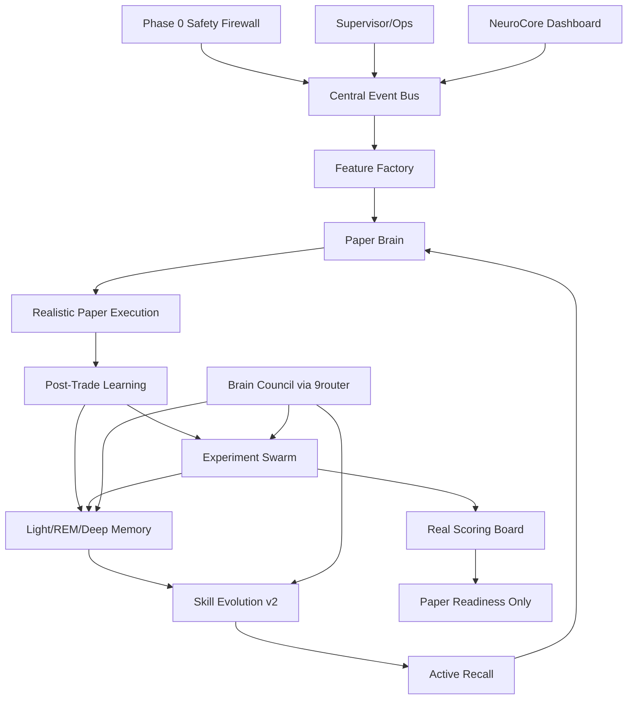

# NeuroCore Agent Nervous System

## Goal

Turn the current agent from "many daemons writing JSON" into a closed-loop paper-learning system:

```text
sense -> event bus -> feature factory -> paper decision -> realistic paper execution
-> review/replay -> experiment swarm -> scoring board
-> memory consolidation -> skill evolution -> active recall -> next decision
```

No live trading is in scope. The system may trade paper aggressively enough to learn, but live execution remains unavailable until a separate future promotion plan passes hard gates.

## Honest Baseline

Current score remains **58/100** for "agent tự học + paper trade 24/7 để tiến tới có edge".

| Area | Score | Read |
| --- | ---: | --- |
| Runtime harness | 78 | 22 agents, supervisor/dashboard mostly OK. |
| Safety/governance | 82 intent, lower system-wide | Good intent, but recursive sanitizer/legacy live scripts missing. |
| Data nervous system | 55 | Many sources, no unified bus/factory. |
| Learning brain | 50 | Memory/skill/replay exist but shallow/buggy. |
| Paper trading edge | 35 | Recent PF/expectancy negative; not edge. |
| Speed of improvement | 45 | Learning loops too low-throughput. |

Target after this plan:

| Stage | Realistic score |
| --- | ---: |
| After Phase 0-8 | 65-70 |
| After Phase 9-18 | 70-75 |
| After 7/14-day trial with good data | 75-82 possible |

No plan can guarantee 80% win-rate or profit. This plan can guarantee cleaner data, faster experiments, harder gates, and measurable learning.

## Scope Challenge

- Existing code: `event_store.py`, `agent_work_queue.py`, `agent_data_contracts.py`, `market_data_lake.py`, `market_feature_store.py`, `paper_portfolio_manager.py`, `paper_execution_lifecycle_loop.py`, `counterfactual_replay_agent.py`, `skill_forge_agent.py`, `memory_consolidation_agent.py`, `llm_council.py`, dashboard, supervisor.
- Minimum useful change: fix safety and memory source bugs, then centralize events and scoring.
- Complexity: high by request. Split into many small phases so each can be tested/audited.
- Selected scope: **EXPANSION**, but paper/shadow only.

## Non-Negotiables

- Paper/shadow only. No live orders.
- Live access must be structurally impossible inside NeuroCore: read-only exchange keys, blocked order endpoints, paper-only adapter, scrubbed child env, and no live SDK/REST/subprocess bypass.
- Paper reports are educational research, not financial advice. Dashboard/readiness wording must never imply live eligibility or guaranteed profit.
- LLM/GPT-5.5/9router can critique, classify, suggest, and summarize only.
- Deterministic gates own sizing, execution simulation, promotion, and safety.
- Every daemon must have heartbeat, latest, history, supervisor registry, and tests.
- Every learning claim must cite evidence ids.
- Every phase ends with tests and loop audit.
- Dirty data is quarantined, not learned from.
- Account truth comes from a deduped ledger, not mutable latest snapshots.
- Exchange metadata truth comes from a fresh versioned instrument registry, not hardcoded filters.
- Safety/risk/config/approval/readiness changes must be signed append-only audit events.
- Setup/A+/5A+ labels are deterministic pre-entry contract outputs, never subjective LLM/user labels.
- Candidate lifecycle and no-trade decisions are first-class evidence; missed candidates count.
- Private/deleted payloads are encrypted/deletable even when audit metadata remains immutable.
- Global resource/cost quotas are governed centrally; local budgets cannot hide aggregate burn.
- UI charts must expose uncertainty, costs, denominators, freshness, setup versions, and readiness eligibility.
- Legacy live/authenticated scripts are non-executable under NeuroCore unless classified in a signed script manifest; unclassified or blocked scripts must fail preflight and emit signed denial events.
- Trial and release evidence must be reproducible from signed roots, immutable trial-family attempts, frozen code/config/schema/metric digests, and secret-scrubbed proof bundles.
- `win_rate` is diagnostic only. No UI/report may style or headline it without expectancy, payoff ratio, effective N, costs, and lower confidence bound beside it.
- Learning claims require deterministic memory/skill/decision-impact deltas. LLM text alone is `hypothesis_only`.
- Operator commands, approvals, dashboard tunnel exposure, backup restore, hotfixes, and trial aborts require explicit owner/role/audit events.

## Cross-Plan Relationship

| Plan | Relationship |
| --- | --- |
| `260621-1650-autonomous-paper-learning-masterplan` | Architectural predecessor. NeuroCore supersedes its implementation detail but does not require marking the old plan completed first. |
| `260624-1226-performance-recovery-sprint` | Related evidence source. Reuse its truth/replay/performance findings; not a hard blocker. |
| `260625-0000-test-to-memory-learning-loop` | Related curriculum source. Reuse test-memory outputs; not a hard blocker. |
| `260621-0136-news-macro-observer` | Input layer. NeuroCore must degrade if this source is stale/incomplete. |
| `260621-1112-shadow-performance-loop` | Shadow baseline source. Fresh shadow metrics must be separated from old shadow batches. |

`blockedBy` intentionally stays empty: this plan can start by hardening current code. Related plans are context/data sources, not start blockers. Do not silently complete or cancel older plans during NeuroCore work; update them only when their own scope is explicitly closed.

## Architecture



## Phases

| Phase | Name | Status |
| ---: | --- | --- |
| 0 | [Safety Firewall Hardening](./phase-00-safety-firewall-hardening.md) | Complete |
| 1 | [Runtime Contract And Ops Registry](./phase-01-runtime-contract-and-ops-registry.md) | Complete |
| 2 | [Event Envelope And Schema Registry](./phase-02-event-envelope-and-schema-registry.md) | Complete |
| 3 | [Central Event Bus Cursors And DLQ](./phase-03-central-event-bus-cursors-and-dlq.md) | Complete |
| 4 | [Source Provenance And Data Trust](./phase-04-source-provenance-and-data-trust.md) | Complete |
| 5 | [Feature Factory Core](./phase-05-feature-factory-core.md) | Complete |
| 6 | [Feature Factory Microstructure And Flow](./phase-06-feature-factory-microstructure-and-flow.md) | Complete |
| 7 | [Paper Execution Realism](./phase-07-paper-execution-realism.md) | Complete |
| 8 | [Sizing And Leverage Calibration](./phase-08-sizing-and-leverage-calibration.md) | Complete |
| 9 | [Experiment Swarm Job Model](./phase-09-experiment-swarm-job-model.md) | Complete |
| 10 | [Replay Coverage And Counterfactual V2](./phase-10-replay-coverage-and-counterfactual-v2.md) | Complete |
| 11 | [Backtest And Walk-Forward Anti-Overfit](./phase-11-backtest-and-walk-forward-anti-overfit.md) | Complete |
| 12 | [Real Scoring Board](./phase-12-real-scoring-board.md) | Complete |
| 13 | [Memory Consolidation V2](./phase-13-memory-consolidation-v2.md) | Complete |
| 14 | [Retrieval And Active Recall](./phase-14-retrieval-and-active-recall.md) | Complete |
| 15 | [Skill Evolution V2](./phase-15-skill-evolution-v2.md) | Complete |
| 16 | [Self-Model Actuator And Curriculum](./phase-16-self-model-actuator-and-curriculum.md) | Complete |
| 17 | [Brain Council And Model Governance](./phase-17-brain-council-and-model-governance.md) | Complete |
| 18 | [Trace Eval And Prompt Regression](./phase-18-trace-eval-and-prompt-regression.md) | Complete |
| 19 | [Obsidian Vault And Skill OS](./phase-19-obsidian-vault-and-skill-os.md) | Complete |
| 20 | [NeuroCore Dashboard](./phase-20-neurocore-dashboard.md) | Complete |
| 21 | [24-7 Reliability And Recovery](./phase-21-24-7-reliability-and-recovery.md) | Complete |
| 22 | [Read-Only MCP Boundary](./phase-22-read-only-mcp-boundary.md) | Pending |
| 23 | [7-Day Burn-In Trial](./phase-23-7-day-burn-in-trial.md) | Pending |
| 24 | [14-Day Paper Readiness Trial](./phase-24-14-day-paper-readiness-trial.md) | Pending |
| 25 | [Loop Audit And Closure](./phase-25-loop-audit-and-closure.md) | Pending |

## Execution Order

Do a vertical MVP first, then expand. User asked for a large plan, but implementation must not wait for every subsystem before the agent becomes better.

### Stage 1 MVP

```text
0 -> 1 -> 2 -> 3 -> 4(minimal) -> 5 -> 6(minimal) -> 7 -> 8 -> 10 -> 12 -> 13 -> 14 -> 16 -> 20(minimal) -> 21(minimal)
```

Stage 1 goal: paper-only safety, clean event contracts, minimal source trust and egress control, core feature rows plus minimal microstructure needed for slippage/funding, realistic paper accounting, replay coverage, Real Scoring Board, memory source fixes, active recall, minimal dashboard visibility, and uptime health.

Stage 1 also includes migration safety: inventory existing JSON/JSONL/latest/history state, dual-write/dual-read where needed, and no destructive state migration.

If any MCP/tool server, dashboard command endpoint, LLM tool bridge, or external/local client is exposed during Stage 1, Phase 22 must move before that exposure. Without such exposure, Phase 22 remains Stage 2.

### Stage 2 Expansion

```text
6(full) -> 9 -> 11 -> 15 -> 17 -> 18 -> 19 -> 22 -> 23 -> 24 -> 25
```

Dependencies:

- `0 -> 1 -> 2 -> 3 -> 4`: no bus/feature work before safety/runtime contracts and minimal source trust.
- `5 -> 6 -> 7 -> 8`: microstructure features feed slippage/funding/size realism.
- `9 -> 10 -> 11 -> 12`: swarm/replay/walk-forward feed scoring.
- `13 -> 14`: retrieval depends on fixed consolidation/indexing.
- `10 + 12 + 13 + 14 -> 15`: skill evolution needs replay, score, memory, and recall evidence.
- `12 + 13 + 15 -> 16`: self-model actuator should queue tasks from scoring/memory/skill gaps.
- `17 -> 18 -> 20`: model governance before trace eval; dashboard after trace/scoring/memory payloads exist.
- `21 -> 23 -> 24 -> 25`: reliability before trials and closure.

Optional/deferable until after Stage 1: full microstructure breadth, Obsidian vault, MCP, large council, full dashboard drilldowns.

## Quality Gate Per Phase

Run targeted tests and a small smoke, then audit before moving on:

```powershell
.\scripts\run_quality_gate.ps1 -ChangedFiles <changed_files> -TargetedTests <targeted_tests>
```

For UI phases:

```powershell
.\scripts\probe_dashboard.ps1 -Endpoint api/status
```

Full regression at major gates:

```powershell
.\scripts\run_quality_gate.ps1 -Full
```

Major gates are: Phase 0, Phase 2/3, Phase 7/8, Phase 10/12, Phase 13/14, Phase 15, Phase 17/18, Phase 20/21, and all trial phases. Any phase touching safety, schema/event contracts, scoring, paper accounting, or promotion must run the full suite unless explicitly marked unable with reason.

Before each implementation phase:

```powershell
git status --short
# record dirty diff intentionally, or use a dedicated branch/worktree
```

State-changing phases must create a backup/checkpoint before migration or daemon cutover.

Quality gate runners must use absolute quoted paths, `Set-StrictMode`, `$ErrorActionPreference='Stop'`, sanitized env/PATH, `PYTHONUTF8=1`, fake sentinel secrets in tests, network disabled by default, and nonzero exit propagation. No test may rely on ambient `.env` or real provider keys.

Dependency policy for new libraries/tools: exact pins, lock/hash where supported, SBOM output, vulnerability audit, no unreviewed postinstall hooks, no dependency changes from skill evolution, and offline/cache install mode for trials.

## CI/Test Harness Realism

CI is a required contract, not a local best effort:

- Required checks: static/syntax, unit, targeted phase tests, fixture replay, secret scan, dependency audit, markdown link/section check, and dashboard API/UI smoke where relevant.
- Matrix: Windows primary runner, pinned Python version, UTC storage tests, Asia/Bangkok report-cutoff tests, and PowerShell 5.1/7 hash/encoding checks for canonical JSON/Markdown.
- Artifacts: JUnit or equivalent test report, coverage summary, fixture replay hashes, screenshot-on-fail, subprocess logs, redacted env manifest, and quality-gate digest.
- Determinism: fixed random seed, temp state root per test, no shared `state/`, fake clock where daemon timing matters, Decimal string assertions, monotonic/wall-clock jump cases, and cleanup verification.
- Network isolation: socket-level deny by default, DNS deny, localhost fixture allowlist, fail on unmocked HTTP, opt-in quarantined live smoke marker only, and no ambient `.env` keys.
- CI budgets: per-test timeout, full-run timeout, memory/disk/tmp/artifact caps, max parallel workers, no arbitrary sleeps in daemon tests, and retry report separating flaky infra from product failure.
- Binance/provider fixtures: recorded USD-M REST/ws fixture server with versioned `exchangeInfo`, leverage brackets, funding, server-time skew, depth update gaps, 429/418, schema drift, and malformed payloads.
- Phase completion cannot cite tests that use live provider/network calls unless the phase explicitly declares an opt-in smoke, quarantine output, and no promotion/readiness use.

## Change/Release Discipline

- Work happens on a named branch or worktree. Each phase produces a phase-to-commit manifest: changed files, generated files, tests, fixture ids, migration/rollback evidence, and dirty-tree explanation.
- Truth-critical generated artifacts require deterministic regeneration command, artifact manifest hashes, stale-generated diff fail, committed-vs-ignored policy, and visible generated markers.
- Migration phases require forward/backward schema compatibility proof, rollback rehearsal, divergence abort criteria, owner/timebox, and post-rollback reconciliation.
- Trial hotfixes require a hotfix branch, commit SHA pin, allowed-file allowlist, mandatory gate reruns, signed reason, and abort/continue matrix.
- Proof/release bundles must run bundle-level secret scan/redaction before export, tag, push, share, or dashboard publication.

## Operational Ownership

- Every run must declare primary operator, backup operator, incident commander, dashboard/security owner, backup/key custodian, trial owner, daily reviewer, hotfix approver, abort authority, and final-report approver.
- Owner fields are machine-readable role ids. Missing owner/role makes incidents, approvals, restore, tunnel exposure, and trial manifests invalid.
- Runbooks are checked in and versioned. Each runbook includes purpose, severity, owner, exact command syntax, expected output, rollback, validation, escalation, and postmortem hooks.

## Stage 1 MVP Gate

Before starting Phase 15+ expansion, these numbers must be visible:

| Metric | Minimum |
| --- | ---: |
| live permission violations | 0 |
| event schema failure rate on core events | 0 for test fixtures |
| paper lifecycle completeness | >= 99% in current trial partition |
| paper account reconciliation | ledger-derived equity/positions match latest/scoring within decimal precision |
| fee/funding/slippage fields on paper closes | 100% in current trial partition |
| fresh instrument snapshot/bracket/price basis | 100% trial paper opens/closes |
| cutoff proof coverage | 100% for decision/replay/score/memory rows in golden path |
| required capability mask | present on every paper decision; missing required data skips |
| atomic risk reservation | concurrent candidate burst respects caps |
| setup contract hash + quality tier | present on every candidate/open/close/replay/score row |
| candidate lifecycle coverage | generated/ranked/skipped/expired/selected/missed events cover trial evaluations |
| shadow freshness/concordance | online trial rows only; pre-registered concordance spec passes |
| resource budget ledger | all paid/LLM/external/swarm calls have reservation + charge |
| golden prompt trace replay | pass on prompt/router/model/schema/sanitizer change |
| chart truth contract | point-level N/effective N/cost/CI/freshness/setup hash visible |
| counterfactual eligible coverage | >= 50% first gate, target 80% later |
| Real Scoring Board windows | trial partition + 10/25/50 closes |
| memory source path bugs | fixed and tested |
| dashboard `/api/status` + minimal NeuroCore payload | 200 OK |
| dashboard probe identity | canonical port registry owner/build id matches |
| supervised duplicate agents | 0 |
| golden e2e scenario | raw source -> event -> feature -> paper -> replay -> score -> memory visible |
| schema/config/metric digest | stored with every Stage 1 gate result |

## Loop Audit Checklist

Before marking any phase complete:

| Question | Must be true |
| --- | --- |
| Safety | No new live order path; sanitizer recursive; secrets redacted. |
| Data | All outputs include schema/version/time/source ids. |
| Replay | New state can be replayed or explicitly marked non-replayable. |
| Learning | No raw anecdote can become rule/skill without evidence gate. |
| Metrics | PF/expectancy/DD/sample/fees/funding/slippage included where relevant. |
| Ops | Heartbeat/latest/history fresh; no duplicate daemon; dashboard API OK. |
| Tests | Targeted tests pass; regression subset pass. |
| Accounting | Ledger rebuild matches latest account/position/scoring snapshots. |
| Instrument | Sizing/fills cite fresh instrument snapshot, bracket, price basis. |
| Audit | Safety/risk/config/approval/readiness changes have signed audit events. |
| Compliance | Output says paper research only, not advice or live eligibility. |
| Time Safety | Decision/replay/score/memory/retrieval use cutoff proof; no future data. |
| Portfolio Risk | Beta/correlation/capability/stress gates run before sizing and readiness. |
| Ontology | Setup contracts, A+/5A+ tiers, regime/capability contracts are deterministic and versioned. |
| Privacy | Retention/erasure works across payload blobs, FTS, vault, backups, restore, and LLM egress. |
| Budget | Resource spend/quota uses central reservations, root budgets, and degraded-mode matrix. |
| UI | User can see what changed and why with Vietnamese-first labels, retained English terms where needed, mobile/a11y usability, and dense above-fold critical blockers. |
| UI Truth | Charts/tooltips/exports share hashes, disclose transforms/costs/uncertainty/freshness, and cannot use misleading chart encodings or green/pass styling for low-N/stale/inconclusive data. |
| Release | Phase commit/release manifest, generated artifact manifest, rollback rehearsal, and proof bundle secret scan exist. |
| Ops | Owners, runbooks, alert fatigue controls, SLO burn, and postmortem state are visible. |
| Anti-Gaming | Trial attempts, scheduled-evaluation census, hidden costs, capital events, and forbidden readiness/live terms are audited. |

## Stop Conditions

Stop implementation and re-audit if:

- Any test or runtime payload shows `can_place_live_orders=true`.
- `.env` secrets appear in logs, dashboard, latest JSON, or plan output.
- Any real-looking provider/exchange key is available in test env.
- Paper PnL improves but fee/funding/slippage fields are missing.
- Account equity/position cannot be rebuilt from ledger or drifts from latest.
- Paper trade lacks fresh instrument snapshot, bracket, price basis, or filter proof.
- Decision, replay, scoring, memory, or recall lacks cutoff proof or uses post-cutoff data.
- Required data capability is missing but trade is used for promotion/readiness.
- Portfolio stress pack fails but readiness/promotion remains pass.
- Setup quality tier/A+ label is missing, subjective, or assigned after outcome.
- Candidate/no-trade lifecycle is incomplete or missed-candidate denominator is absent.
- Shadow readiness evidence is stale, backfilled, unmatched, or lacks concordance tolerances.
- Private/deleted payload appears in FTS/vault/backup/LLM prompt after erasure.
- Paid/provider/LLM/resource call has no central budget reservation/charge.
- Prompt/model/schema/sanitizer change lacks golden trace replay.
- Dashboard chart hides denominator/cost/uncertainty/freshness/setup version or marks monitoring-only data as ready.
- Any legacy live/authenticated script is executable, imported, or displayed as authoritative without quarantine and signed denial path.
- Any unclassified manual script or operator command bypasses manifest, role, approval, and signed audit ledger.
- Skill forge applies patch without evidence ids and rollback criteria.
- Skill forge edits its own judges, fixtures, scorer, evaluator, evidence resolver, or promotion gates.
- Skill promotion lacks a signed promotion manifest, clean-worktree tests, rollback rehearsal, and semantic conflict check.
- Skill/tool/config/risk threshold changes without signed approval manifest.
- Counterfactual coverage is computed as `complete/replays` instead of `complete/eligible`.
- Walk-forward data is stale but promotion does not fail.
- Dashboard API fails or restarts loop repeatedly.
- Dashboard/report/export implies live readiness or financial advice.
- Agent says it "learned" but no event ids/memory ids changed.
- Agent says it "learned" but no deterministic consumer impact or before/after decision diff exists.
- Trial headline hides failed/aborted same-family attempts, invalid opens, scheduled-evaluation gaps, or resets.
- Report/dashboard celebrates win-rate without expectancy, payoff ratio, effective N, LCB, and cost completeness beside it.
- Any provider/LLM/API/data/compute spend is missing, unreserved, or excluded from spend-adjusted reports.
- Event hash-chain roots are missing, non-monotonic, or locally regenerated without external/signed checkpoint evidence.
- A capital reset/deposit/withdrawal/correction bridges one equity curve or hides drawdown.
- Any mandatory dashboard widget is stale/unknown while top-level status is green.

## Metrics To Add

```text
event_bus_lag_seconds
event_dlq_count
schema_contract_failure_rate
feature_missing_rate_by_source
source_trust_weighted_coverage
paper_fill_realism_error_proxy
funding_fee_impact_pct
fee_drag_pct
liquidation_avoidance_blocks
counterfactual_eligible_count
counterfactual_complete_coverage
experiment_jobs_per_day
experiment_oos_pass_rate
pf_after_fees
expectancy_after_fees
expectancy_lower_bound
max_drawdown_pct
mae_mfe_review_coverage
skill_patch_accept_rate
skill_patch_revert_rate
memory_promotion_rate
memory_contradiction_rate
active_recall_hit_rate
llm_route_deep_model_rate
llm_sanitizer_violation_count
dashboard_healthz_success_rate
host_sleep_gap_minutes
dashboard_liveness_success_rate
dashboard_readiness_success_rate
dashboard_degraded_dependency_count
alert_page_count_by_severity
alert_duplicate_ratio
alert_false_positive_rate
error_budget_burn_rate
restart_incidents_per_day
unacked_incident_max_age_minutes
MTTA_minutes
MTTR_minutes
backup_restore_drill_pass_rate
paper_account_reconciliation_drift
instrument_registry_staleness_seconds
exchange_filter_reject_rate
signed_audit_ledger_gap_count
dependency_audit_critical_count
advice_boundary_ledger_gap_count
cutoff_proof_violation_count
decision_capability_blind_trade_count
portfolio_beta_exposure_pct
atomic_risk_reservation_reject_count
stress_pack_fail_count
setup_contract_missing_count
candidate_census_gap_count
shadow_concordance_fail_count
erasure_restore_violation_count
resource_budget_remaining_pct
budget_exhaustion_event_count
operating_cost_adjusted_expectancy
cost_per_valid_trade
cost_per_accepted_skill_patch
cost_per_useful_experiment
hidden_unreserved_spend_count
model_canary_regression_count
chart_truth_contract_violation_count
script_manifest_violation_count
legacy_script_blocked_count
trial_attempts_started
trial_attempts_passed
scheduled_eval_census_gap_count
capital_event_count
learning_claim_without_delta_count
memory_index_bytes
memory_prune_count
stale_belief_influence_count
skill_promotion_manifest_gap_count
rollback_rehearsal_fail_count
```

## External References

- Hermes Agent: https://github.com/NousResearch/hermes-agent
- OpenClaw Auto-Dream: https://github.com/LeoYeAI/openclaw-auto-dream
- OpenClaw Dreaming: https://docs.openclaw.ai/concepts/dreaming
- Obsidian Skills: https://github.com/kepano/obsidian-skills
- LangGraph: https://github.com/langchain-ai/langgraph
- NautilusTrader: https://github.com/nautechsystems/nautilus_trader
- vectorbt: https://github.com/polakowo/vectorbt
- Qlib: https://github.com/microsoft/qlib
- Langfuse: https://github.com/langfuse/langfuse
- promptfoo: https://github.com/promptfoo/promptfoo
- MCP: https://modelcontextprotocol.io/docs/getting-started/intro

## Cook Handoff

When implementing:

```powershell
/ck:cook "E:\keo-moi-mail\trading-agent\plans\260628-2343-neurocore-agent-nervous-system\plan.md"
```
