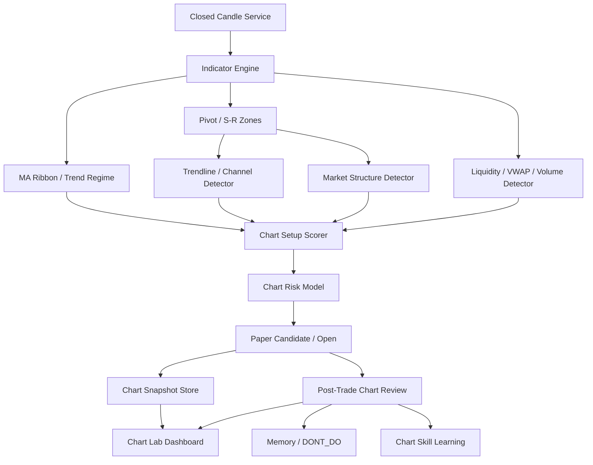

# Chart Intelligence v1

## Overview

Build the missing chart brain for the paper-only futures agent.

Target loop:

```text
closed candles -> chart features -> structure/liquidity evidence
-> deterministic chart setup score -> structure SL/TP
-> paper decision snapshot -> post-trade chart review
-> skill/memory/DONT_DO updates -> Chart Lab inspection
```

This plan does not enable live trading. It improves paper trade quality, replayability, and learning.

## Scope Challenge

| Question | Answer |
| --- | --- |
| What already exists? | `chart_scan.py` has ad hoc multi-timeframe TV scoring. `render_chart.py` draws Binance futures candles with EMA/volume/RSI. `market_feature_store.py` has canonical feature rows, cutoff proof, RSI/EMA/ATR/volume. Paper lifecycle, counterfactual, skill forge, memory, and dashboard already exist. |
| Minimum useful change | Add reusable chart contracts, closed-candle service, indicator/structure/liquidity detectors, setup scorer, risk model, snapshots, post-trade review, and Chart Lab. |
| Complexity check | >8 files and many modules. Justified because chart intelligence is a new domain layer. Split into small phases with tests and audit gates. |
| Selected scope | Hold-plus: comprehensive chart layer, but paper-only and deterministic. |

## Non-Negotiables

- Paper/shadow only. No live orders.
- Use closed candles only. No forming candle in decision features unless explicitly marked `diagnostic_only`.
- Every chart-derived signal needs `decision_cutoff`, `source_ids`, `input_event_ids`, `cutoff_proof`, `schema_version`, and `chart_model_version`.
- Chart source timestamps must be explicit. Do not silently fallback missing `available_at`, `known_at`, `ingested_at`, or `finalized_at` to close time for paper-eligible chart data.
- Futures chart data must declare price basis: last-trade, mark, or index. Entry chart may use last-trade candles; liquidation/funding/risk checks must cite mark/index where required.
- Multi-timeframe decisions must align closed candle boundaries. Native vs resampled candles must declare source and cannot be mixed silently.
- LLM may critique or summarize chart evidence only. It cannot create entries, loosen risk, or promote skills.
- No chart feature can learn from future candles, post-close outcomes, or current latest snapshots during replay.
- A+/5A+ chart labels must be deterministic and pre-entry.
- Chart snapshots are evidence artifacts, not trade recommendations.
- Dashboard wording stays Vietnamese-first but keeps trading terms where clearer: EMA, MA, RSI, MACD, ADX, ATR, VWAP, BOS, CHOCH, liquidity sweep, R:R, PF.

## Reuse Map

| Existing file | Reuse |
| --- | --- |
| `market_feature_store.py` | cutoff proof, feature ids, provenance, feature confidence |
| `market_data_lake.py` | source/cache pattern |
| `tradingagents_crypto_src/tradingagents/dataflows/crypto_indicators.py` | existing pure pandas TA helpers; candidate source for canonical indicator math |
| `tradingagents_crypto_src/tradingagents/crypto/tv_data.py` | optional TradingView context only; not source of truth until provenance/cutoff mask exists |
| `chart_scan.py` | scoring ideas only; refactor concepts into deterministic modules |
| `render_chart.py` | renderer baseline; replace script-only interface with snapshot artifact API |
| `paper_candidate_feeder.py` | candidate attachment; current synthetic 3-candle proxy must not satisfy chart decisions |
| `paper_execution_lifecycle_loop.py` | attach chart snapshot ids to paper open/close lifecycle |
| `counterfactual_replay_agent.py` | replay chart variants and no-lookahead checks |
| `skill_forge_agent.py` | accept chart skill patches with evidence gates |
| `memory_consolidation_agent.py` / `dont_do_memory.py` | promote chart lessons and failure rules |
| `agent_status_dashboard.py` | add `Chart Lab` page and chart drilldowns inside existing stdlib inline HTML/CSS/JS dashboard |

## New Contracts

| Contract | Purpose |
| --- | --- |
| `ChartCandleBatch.v1` | Symbol/timeframe closed OHLCV bundle with availability, freshness, source, and cutoff proof. |
| `ChartSourcePolicy.v1` | Provider priority, price basis, native/resampled status, outage/rate-limit behavior, and finality rules. |
| `ChartIndicatorBundle.v1` | EMA/MA ribbon, RSI, MACD, ADX, ATR, VWAP, volume ratios by timeframe. |
| `ChartStructureBundle.v1` | Pivots, support/resistance zones, trendlines, channels, HH/HL/LH/LL, BOS, CHOCH. |
| `ChartLiquidityBundle.v1` | Equal highs/lows, wick sweeps, stop-cluster candidates, volume confirmation, fakeout flags. |
| `ChartSetupScore.v1` | Side, score, setup family, blockers, reason codes, confidence, eligible/ineligible state. |
| `ChartRiskPlan.v1` | Entry reference, invalidation, SL, TP ladder, R:R, ATR/structure stop distance, leverage hint. |
| `ChartArtifactRetention.v1` | Snapshot retention, pruning, digest-preserving metadata, and storage budget rules. |
| `ChartSnapshot.v1` | Rendered chart artifact with overlays, image path, data hash, point ids, and decision cutoff. |
| `ChartPostTradeReview.v1` | MFE/MAE vs zones/lines, SL/TP quality, entry timing, structure outcome, lesson candidates. |
| `ChartIntelligenceReport.v1` | Top-level bundle tying candles, indicators, structure, liquidity, score, risk, snapshots, and capability mask together. |
| `PaperPositionSnapshot.v2` | Immutable candidate, risk, feature, preflight, chart, and source digests captured at open and carried into close. |
| `LearningUpdate.v1` | Learning event requiring lifecycle-clean, cutoff-clean, `learning_eligible=true` post-trade evidence. |

## Architecture



## Phases

| Phase | Name | Status |
| ---: | --- | --- |
| 0 | [Chart Audit And Contracts](./phase-00-chart-audit-and-contracts.md) | Complete |
| 1 | [Closed Candle Service And Cache](./phase-01-candle-service-and-cache.md) | Complete |
| 2 | [Indicator Engine](./phase-02-indicator-engine.md) | Complete |
| 3 | [MA Ribbon And Trend Regime](./phase-03-ma-ribbon-and-trend-regime.md) | Complete |
| 4 | [Pivots And Support Resistance](./phase-04-pivots-support-resistance.md) | Complete |
| 5 | [Trendlines And Channels](./phase-05-trendlines-channels.md) | Complete |
| 6 | [Market Structure](./phase-06-market-structure.md) | Complete |
| 7 | [Liquidity Volume VWAP](./phase-07-liquidity-volume-vwap.md) | Complete |
| 8 | [Chart Setup Scorer](./phase-08-chart-setup-scorer.md) | Complete |
| 9 | [Chart Risk Model](./phase-09-chart-risk-model.md) | Complete |
| 10 | [No-Lookahead Replay Proof](./phase-10-no-lookahead-replay-proof.md) | Complete |
| 11 | [Annotated Chart Renderer](./phase-11-annotated-chart-renderer.md) | Complete |
| 12 | [Paper Trade Chart Snapshots](./phase-12-paper-trade-chart-snapshots.md) | Complete |
| 13 | [Post-Trade Chart Review](./phase-13-post-trade-chart-review.md) | Pending |
| 14 | [Chart Skill Learning](./phase-14-chart-skill-learning.md) | Pending |
| 15 | [Chart Lab Dashboard](./phase-15-chart-lab-dashboard.md) | Pending |
| 16 | [Backtest Burn-In And Closure](./phase-16-backtest-burnin-closure.md) | Pending |

## Execution Graph

```text
0 -> 1 -> 2
2 -> 3,4,7
4 -> 5,6
3,5,6,7 -> 8 -> 9 -> 10
8,9,10 -> 11 -> 12 -> 13 -> 14
11,12,13,14 -> 15 -> 16
```

Parallel-safe after Phase 2:

- Phase 3 owns MA/ribbon/trend files.
- Phase 4 owns pivot/S-R files.
- Phase 7 owns liquidity/VWAP/volume files.
- Phase 5/6 wait for pivots.

## Quality Gate Per Phase

Required before moving to next phase:

```powershell
pytest -q tests/test_chart_*.py
pytest -q tests/test_phase_05_feature_factory_core.py tests/test_paper_execution_lifecycle_loop.py tests/test_agent_status_dashboard.py
git diff --check
```

Major gates after Phases 2, 8, 10, 12, 15, 16:

```powershell
pytest -q
```

UI gates after Phase 15:

```powershell
python -m pytest -q tests/test_agent_status_dashboard.py
```

## Loop Audit Checklist

Before marking any phase complete:

| Area | Must be true |
| --- | --- |
| Data | Closed candles only, timestamped, source ids present, stale data degraded. |
| Futures mechanics | Price basis, exchange filters, leverage brackets, tick/step/min-notional, and mark/index risk references are explicit. |
| MTF alignment | All timeframe features align by closed candle boundary and declare native/resampled provenance. |
| No-lookahead | Decision output can be rebuilt from inputs available before cutoff. |
| Strict timestamps | Missing source finality timestamps cannot pass paper-eligible chart gating. |
| Replay | Golden fixture produces stable hashes under shuffled input order. |
| Risk | Chart score can suggest paper risk only; cannot open live or loosen live gates. |
| Learning | Lessons need lifecycle-clean, cutoff-clean, `learning_eligible=true` trade/replay evidence ids, not LLM opinion. |
| UI | Chart/tooltip/table/export show same values and point hashes. |
| Dashboard payload | `/api/status` remains compact; Chart Lab uses summaries plus drilldown ids, not huge embedded images/series. |
| Storage | Chart snapshots have retention/pruning and content-addressed metadata. |
| Tests | Targeted tests and regression subset pass. |
| Ops | Heartbeat/latest/history added for any new daemon. |

## Done Criteria

- Agent can fetch and cache 1D/4H/1H/15M/5M/1M closed futures candles.
- Agent knows whether each chart/risk number came from last-trade, mark, or index price.
- Agent computes indicators deterministically with no future data.
- Agent detects S/R zones, trendlines, channels, structure, liquidity sweeps, and volume confirmation.
- Every paper candidate can cite chart evidence or explain why chart evidence is missing.
- Every paper open/close gets chart snapshot ids.
- Post-trade review says whether chart read was good, late, early, overextended, liquidity-trapped, or structurally invalid.
- Chart skill learning updates staged skill patches or DONT_DO rules with evidence ids.
- Dashboard `Chart Lab` can inspect symbol/timeframe, overlays, score reasons, risk plan, snapshots, and learning progress.
- Full suite passes.

## Stop Conditions

- Any chart path reads current/latest candles during historical replay.
- Any feature lacks cutoff proof but affects paper score or risk.
- Any chart candle source lacks explicit finality timestamps but remains paper-eligible.
- Any chart/risk calculation mixes last/mark/index price without declaring basis.
- Native and resampled candles are mixed without source policy.
- Chart snapshots grow unbounded or can be served by path traversal.
- Any post-trade chart review runs learning before lifecycle validation.
- Any setup ranking consumes `learning_eligible=false` chart review.
- Any chart score labels A+/5A+ after trade outcome is known.
- Any live-order flag, endpoint, or permission is introduced.
- Chart renderer hides missing/stale data or zero-fills unknown values.
- Dashboard chart tooltip/table/export disagree.
- Paper PnL improves but chart evidence ids are missing.

## Cook Handoff

```powershell
/ck:cook "E:\keo-moi-mail\trading-agent\plans\260630-1921-chart-intelligence-v1\plan.md"
```
